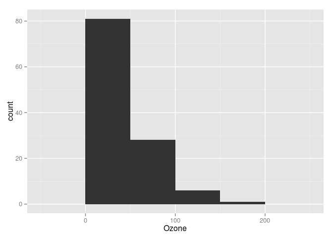

In order to start we need the following packages.

``` r
library(ggplot2) # our plotting package
library(tidyr)   # for reshaping between wide and long format
library(dplyr)   # for general data transformation
```

The Name Example
----------------

The data contains the first and last letter of some peoples given names.

``` r
name <- data.frame(
  First = c("M", "L", "A", "K", "F",
            "P", "A", "S", "J", "E",
            "M", "D", "J", "J", "F",
            "C", "S"),
  Last  = c("L", "A", "O", "A", "O",
            "O", "B", "A", "Y", "E",
            "A", "S", "S", "N", "A",
            "A", "E"),
  Sex   = c("M", "F", "M", "F", "M",
            "M", "M", "F", "F", "M",
            "F", "M", "M", "M", "F",
            "F", "F")
)
```

We reshape the data a bit.

``` r
name %>% # Take the name data frame...
  mutate(
    # ...and add columns with the numerical alphabet positions
    # of the first and last letters.
    First_n = match(First, LETTERS),
    Last_n  = match(Last, LETTERS),
    # Also add a column with combined first and last letters.
    Comb    = paste0(First, Last)) -> name
```

This is a scatterplot of the alphabetical letter positions.

``` r
ggplot(name) +
  geom_point(aes(x = First_n, y = Last_n, label = Comb))
```


We can label the numerical scales with the corresponding letters.

``` r
ggplot(name) +
  geom_point(aes(x = First_n, y = Last_n, label = Comb)) +
  scale_x_continuous(breaks = 1:26, labels = LETTERS) +
  scale_y_continuous(breaks = 1:26, labels = LETTERS)
```


Instead of points, we might as well draw letter pairs.

``` r
ggplot(name) +
  geom_text(aes(x = First_n, y = Last_n, label = Comb)) +
  scale_x_continuous(breaks = 1:26, labels = LETTERS) +
  scale_y_continuous(breaks = 1:26, labels = LETTERS)
```


Other Examples
--------------

A data set of weight over time for chickens on different diets.

``` r
head(ChickWeight)
```

    ##   weight Time Chick Diet
    ## 1     42    0     1    1
    ## 2     51    2     1    1
    ## 3     59    4     1    1
    ## 4     64    6     1    1
    ## 5     76    8     1    1
    ## 6     93   10     1    1

For each chicken we draw a red line of weight over time.

``` r
ggplot(ChickWeight) +
  geom_line(aes(x = Time, y = weight, group = Chick),
            colour = "red")
```


A data set of environmental indicators.

``` r
head(airquality)
```

    ##   Ozone Solar.R Wind Temp Month Day
    ## 1    41     190  7.4   67     5   1
    ## 2    36     118  8.0   72     5   2
    ## 3    12     149 12.6   74     5   3
    ## 4    18     313 11.5   62     5   4
    ## 5    NA      NA 14.3   56     5   5
    ## 6    28      NA 14.9   66     5   6

We plot a histogram of ozone levels. Each bin has a width of 50.

``` r
ggplot(airquality) +
  geom_histogram(aes(x = Ozone),
                 binwidth = 50)
```



From the same data we make a boxplot. Note that we have to tell ggplot where to put the boxplot on the x-axis.

``` r
ggplot(airquality) +
  geom_boxplot(aes(x = 0, y = Ozone))
```

    ## Warning in loop_apply(n, do.ply): Removed 37 rows containing non-finite
    ## values (stat_boxplot).


