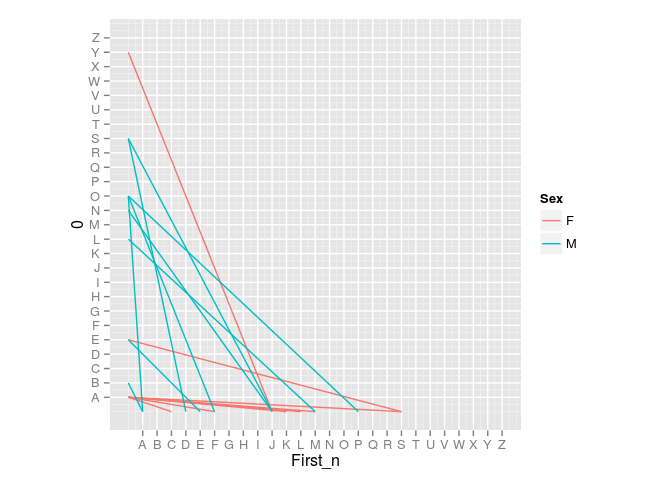
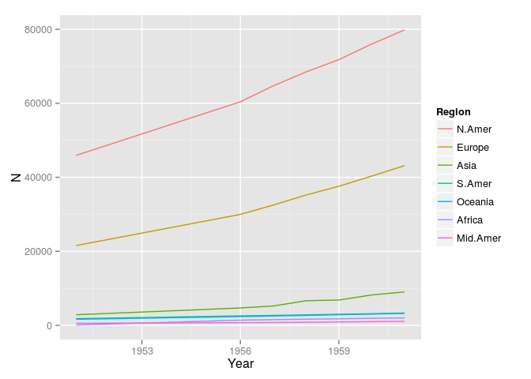
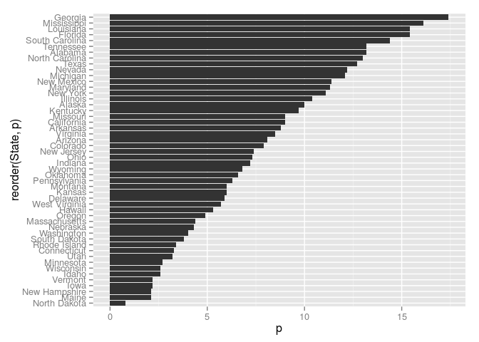
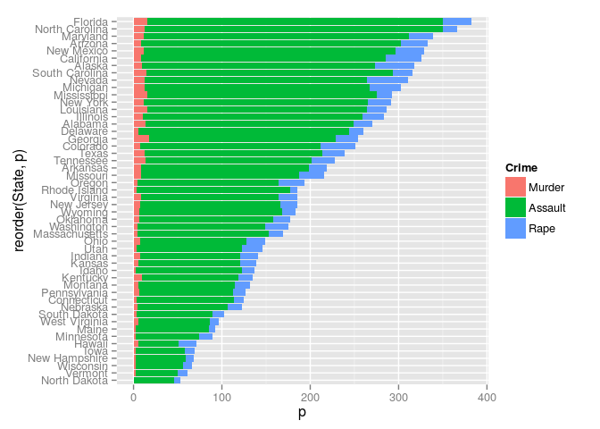
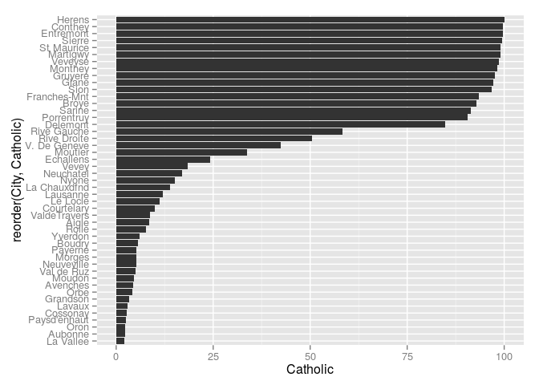
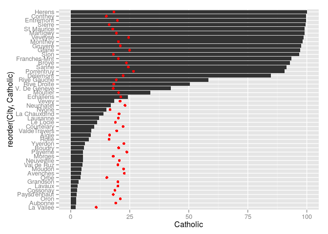
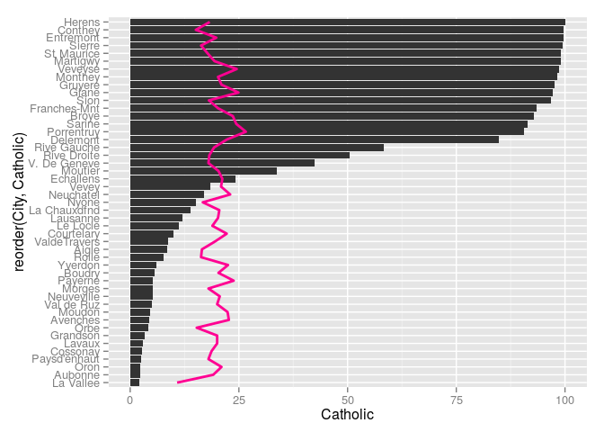
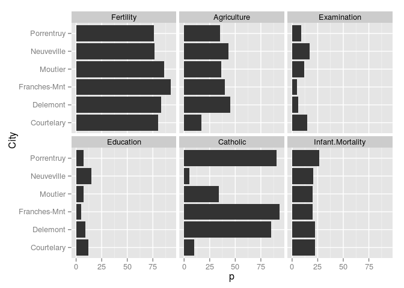

``` r
library(ggplot2) # our plotting package
library(tidyr)   # for reshaping between wide and long format
library(dplyr)   # for general data transformation
```

    ## 
    ## Attaching package: 'dplyr'
    ## 
    ## The following object is masked from 'package:stats':
    ## 
    ##     filter
    ## 
    ## The following objects are masked from 'package:base':
    ## 
    ##     intersect, setdiff, setequal, union

Revisiting the Name Data Set
----------------------------

The data set is stored as an `Rdata` file. We can load it from the disk and it immediately appears as an object in our workspace. In contrast to other data sources (e.g. csv, dat) there is no need to assign it to an object first.

``` r
load("../../data/name.Rdata")
head(name)
```

    ##   First Last Sex First_n Last_n Comb
    ## 1     M    L   M      13     12   ML
    ## 2     L    A   F      12      1   LA
    ## 3     A    O   M       1     15   AO
    ## 4     K    A   F      11      1   KA
    ## 5     F    O   M       6     15   FO
    ## 6     P    O   M      16     15   PO

Connect the letter pairs with a line segment and colour the segments by sex.

``` r
ggplot(name) +
  geom_segment(aes(x = First_n, y = 0,
                   xend = 0, yend = Last_n,
                   colour = Sex)) +
  scale_x_continuous(breaks = 1:26, labels = LETTERS, limits = c(0, 26)) +
  scale_y_continuous(breaks = 1:26, labels = LETTERS, limits = c(0, 26)) +
  coord_fixed() # Units on x and y are represented by the same distance.
```



Reshaping Data: World Phones
----------------------------

``` r
head(WorldPhones)
```

    ##      N.Amer Europe Asia S.Amer Oceania Africa Mid.Amer
    ## 1951  45939  21574 2876   1815    1646     89      555
    ## 1956  60423  29990 4708   2568    2366   1411      733
    ## 1957  64721  32510 5230   2695    2526   1546      773
    ## 1958  68484  35218 6662   2845    2691   1663      836
    ## 1959  71799  37598 6856   3000    2868   1769      911
    ## 1960  76036  40341 8220   3145    3054   1905     1008

We use `dplyr` and `tidyr` to reshape our data.

``` r
WorldPhones %>%
  # Convert to data frame.
  as.data.frame %>%
  # Add a year column containing rownames of "WorldPhones".
  mutate(Year = as.numeric(rownames(.))) %>%
  # Reshape into long-format.
  gather(key = Region, value = N, -Year) -> W2

head(W2)
```

    ##   Year Region     N
    ## 1 1951 N.Amer 45939
    ## 2 1956 N.Amer 60423
    ## 3 1957 N.Amer 64721
    ## 4 1958 N.Amer 68484
    ## 5 1959 N.Amer 71799
    ## 6 1960 N.Amer 76036

A line plot of telephones in use over time by region.

``` r
ggplot(W2) +
  geom_line(aes(x = Year, y = N, group = Region, colour = Region))
```



Reshaping Data: USArrests
=========================

``` r
head(USArrests)
```

    ##            Murder Assault UrbanPop Rape
    ## Alabama      13.2     236       58 21.2
    ## Alaska       10.0     263       48 44.5
    ## Arizona       8.1     294       80 31.0
    ## Arkansas      8.8     190       50 19.5
    ## California    9.0     276       91 40.6
    ## Colorado      7.9     204       78 38.7

``` r
USArrests %>%
  # Add a state column containing rownames of "USArrests".
  mutate(State = rownames(.)) %>%
  # Reshape into long format.
  gather(key = Crime, value = p, c(1, 2, 4)) -> USA

head(USA)
```

    ##   UrbanPop      State  Crime    p
    ## 1       58    Alabama Murder 13.2
    ## 2       48     Alaska Murder 10.0
    ## 3       80    Arizona Murder  8.1
    ## 4       50   Arkansas Murder  8.8
    ## 5       91 California Murder  9.0
    ## 6       78   Colorado Murder  7.9

Select the murder cases.

``` r
USA %>% filter(Crime == "Murder") -> murder
```

Barchart of murder rate per state.

``` r
ggplot(murder) +
  geom_bar(aes(x = reorder(State, p), y = p),
           stat = "identity") + # Take the y values form the data,
                                # don't do any additional transformations.
  coord_flip() # Interchange x and y-scales to do horizontal bars.
```



Barchart of all crimes per state.

``` r
ggplot(USA) +
  geom_bar(aes(x = reorder(State, p), y = p, fill = Crime),
           stat = "identity") +
  coord_flip()
```



Reshaping Data: Paolos Example
------------------------------

Swiss data on economic indicators.

``` r
head(swiss)
```

    ##              Fertility Agriculture Examination Education Catholic
    ## Courtelary        80.2        17.0          15        12     9.96
    ## Delemont          83.1        45.1           6         9    84.84
    ## Franches-Mnt      92.5        39.7           5         5    93.40
    ## Moutier           85.8        36.5          12         7    33.77
    ## Neuveville        76.9        43.5          17        15     5.16
    ## Porrentruy        76.1        35.3           9         7    90.57
    ##              Infant.Mortality
    ## Courtelary               22.2
    ## Delemont                 22.2
    ## Franches-Mnt             20.2
    ## Moutier                  20.3
    ## Neuveville               20.6
    ## Porrentruy               26.6

``` r
swiss %>%
  # Add a city column containing the rownames of "swiss".
  mutate(City = rownames(.)) -> swi

head(swi)
```

    ##   Fertility Agriculture Examination Education Catholic Infant.Mortality
    ## 1      80.2        17.0          15        12     9.96             22.2
    ## 2      83.1        45.1           6         9    84.84             22.2
    ## 3      92.5        39.7           5         5    93.40             20.2
    ## 4      85.8        36.5          12         7    33.77             20.3
    ## 5      76.9        43.5          17        15     5.16             20.6
    ## 6      76.1        35.3           9         7    90.57             26.6
    ##           City
    ## 1   Courtelary
    ## 2     Delemont
    ## 3 Franches-Mnt
    ## 4      Moutier
    ## 5   Neuveville
    ## 6   Porrentruy

Plot the percentage of catholic population in each city.

``` r
ggplot(swi, aes(x = reorder(City, Catholic))) +
  geom_bar(aes(y = Catholic),
           stat = "identity") +
  coord_flip()
```



Plot the percentage of catholic population in each city and add points for Infant mortality.

``` r
ggplot(swi, aes(x = reorder(City, Catholic))) +
  geom_bar(aes(y = Catholic),
           stat = "identity") +
  geom_point(aes(y = Infant.Mortality),
             colour = "red") +
  coord_flip()
```



Instead of points, we can also add a line. But because we got a discrete axis the ggplot line geom gets a bit confused and we have to specify that all our Infant Mortality values belong to the same line, i.e. the same group.

``` r
ggplot(swi, aes(x = reorder(City, Catholic))) +
  geom_bar(aes(y = Catholic),
           stat = "identity") +
  geom_line(aes(y = Infant.Mortality, group = 1),
             colour = "#FF0092", size = 1) +
  coord_flip()
```



Reshaping Data: Steffies Example
--------------------------------

Steffie decided to reshape all the economic indicator variables into an indicator- and a value column.

``` r
head(swi) %>%
  gather(key = Indicator, value = p, 1:6) -> swi

head(swi)
```

    ##           City Indicator    p
    ## 1   Courtelary Fertility 80.2
    ## 2     Delemont Fertility 83.1
    ## 3 Franches-Mnt Fertility 92.5
    ## 4      Moutier Fertility 85.8
    ## 5   Neuveville Fertility 76.9
    ## 6   Porrentruy Fertility 76.1

With this data structure she's able to "facet" over all indicators.

``` r
ggplot(swi) +
  geom_bar(aes(x = City, y = p),
           stat = "identity") +
  facet_wrap(~ Indicator) +
  coord_flip()
```


