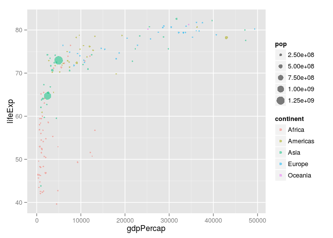
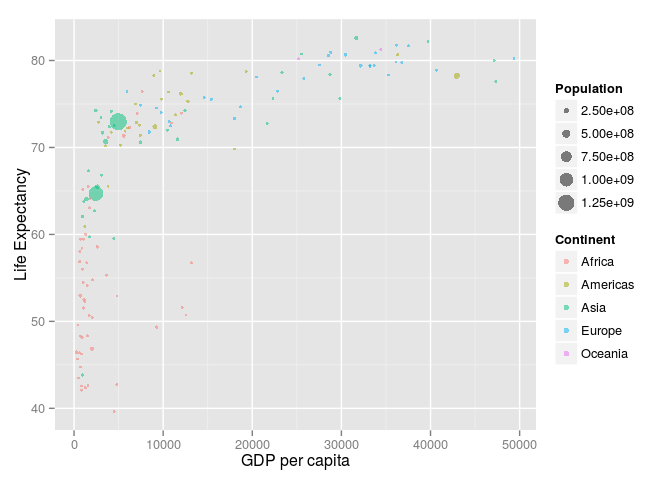
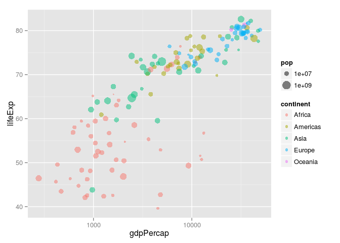
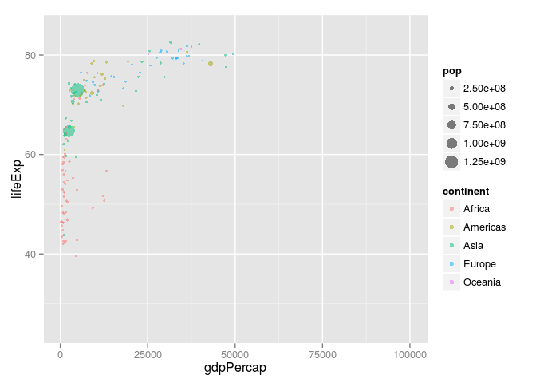
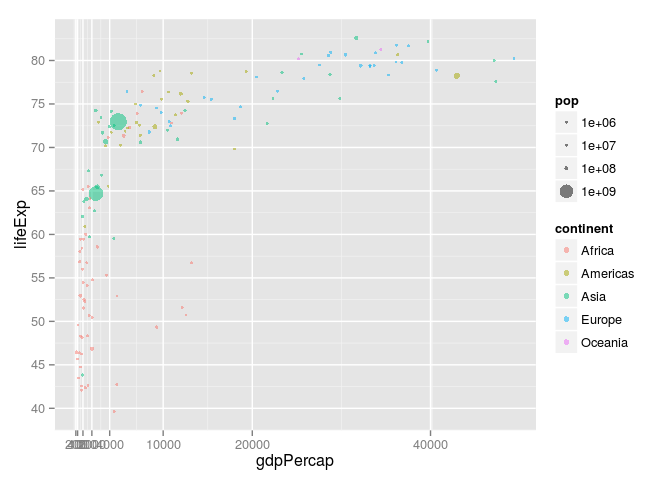
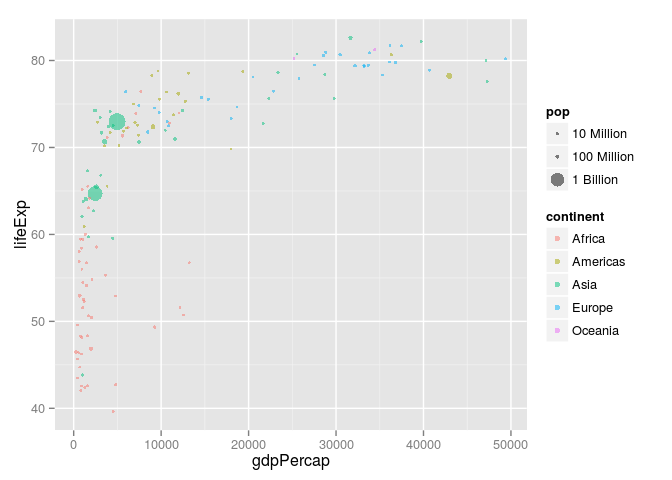
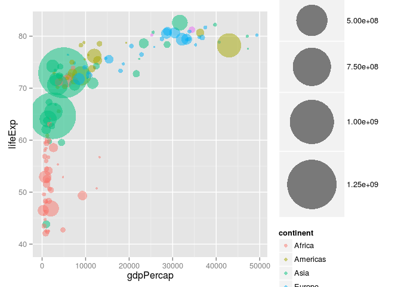
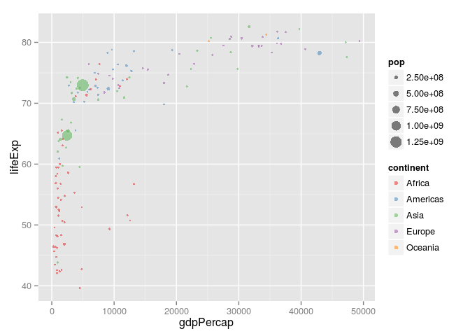
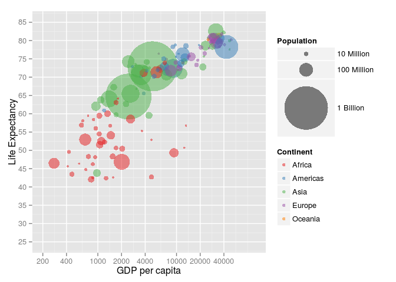

``` r
library(ggplot2) # our plotting package
library(dplyr)   # for general data transformation
```

    ## 
    ## Attaching package: 'dplyr'
    ## 
    ## The following object is masked from 'package:stats':
    ## 
    ##     filter
    ## 
    ## The following objects are masked from 'package:base':
    ## 
    ##     intersect, setdiff, setequal, union

Gapminder
---------

This package provides us with data from the Gapminder webpage <http://www.gapminder.org/>.

``` r
library(gapminder)

head(gapminder)
```

    ##       country continent year lifeExp      pop gdpPercap
    ## 1 Afghanistan      Asia 1952  28.801  8425333  779.4453
    ## 2 Afghanistan      Asia 1957  30.332  9240934  820.8530
    ## 3 Afghanistan      Asia 1962  31.997 10267083  853.1007
    ## 4 Afghanistan      Asia 1967  34.020 11537966  836.1971
    ## 5 Afghanistan      Asia 1972  36.088 13079460  739.9811
    ## 6 Afghanistan      Asia 1977  38.438 14880372  786.1134

Subset to year 2007.

``` r
gapminder %>% filter(year == 2007) -> gappy

head(gappy)
```

    ##       country continent year lifeExp      pop  gdpPercap
    ## 1 Afghanistan      Asia 2007  43.828 31889923   974.5803
    ## 2     Albania    Europe 2007  76.423  3600523  5937.0295
    ## 3     Algeria    Africa 2007  72.301 33333216  6223.3675
    ## 4      Angola    Africa 2007  42.731 12420476  4797.2313
    ## 5   Argentina  Americas 2007  75.320 40301927 12779.3796
    ## 6   Australia   Oceania 2007  81.235 20434176 34435.3674

"Bubblecharts" are just scatterplots with pointsize mapped to some variable. Note that the mapping of visual dimension to the data dimension takes place inside the `aes` command. These are "aesthetics". On the other hand, we don't treat the general transparency of our points (alpha) as an aesthetic. It is a fixed value independent of the data.

``` r
bubble <-
  ggplot(gappy) +
  geom_point(aes(x      = gdpPercap,
                 y      = lifeExp,
                 size   = pop,
                 colour = continent),
             alpha = 0.5)
bubble
```



Things we can do with scales... We can rename our scales:

``` r
bubble +
  scale_x_continuous(name = "GDP per capita") +
  scale_y_continuous(name = "Life Expectancy") +
  scale_size(name = "Population") +
  scale_color_discrete(name = "Continent")
```



We can transform our scales:

``` r
bubble +
  scale_x_continuous(trans = "log10") +
  scale_size(trans = "log10")
```



We can change the limits of our scales:

``` r
bubble +
  scale_x_continuous(limits = c(200, 100000)) +
  scale_y_continuous(limits = c(25, 85))
```



We can change the breaks (markings) of our scales:

``` r
bubble +
  scale_x_continuous(breaks = c(200, 400, 1000, 2000, 4000, 10000, 20000, 40000)) +
  scale_y_continuous(breaks = seq(25, 85, 5)) +
  scale_size(breaks = c(10^(6:9)))
```



We can change the labels (text at breaks) of our scales:

``` r
bubble +
  scale_size(breaks = c(10^(7:9)),
             labels = c("10 Million", "100 Million", "1 Billion"))
```



There are also specialized scales with unique attributes, like: The maximum area of a "bubble"...

``` r
bubble +
  scale_size_area(max_size = 30)
```



...or the colours used in a colour scale.

``` r
bubble +
  scale_color_brewer(type = "qual", palette = 6)
```



This is how the plot looks if we apply all these scale operations at once:

``` r
bubble +
  scale_x_continuous(name = "GDP per capita",
                     trans = "log10",
                     limits = c(200, 100000),
                     breaks = c(200, 400, 1000, 2000, 4000, 10000, 20000, 40000)) +
  scale_y_continuous(name = "Life Expectancy",
                     limits = c(25, 85),
                     seq(25, 85, 5)) +
  scale_size_area(name = "Population",
                  breaks = c(10^(7:9)),
                  labels = c("10 Million", "100 Million", "1 Billion"),
                  max_size = 30) +
  scale_color_brewer(name = "Continent",
                     type = "qual", palette = 6)
```


