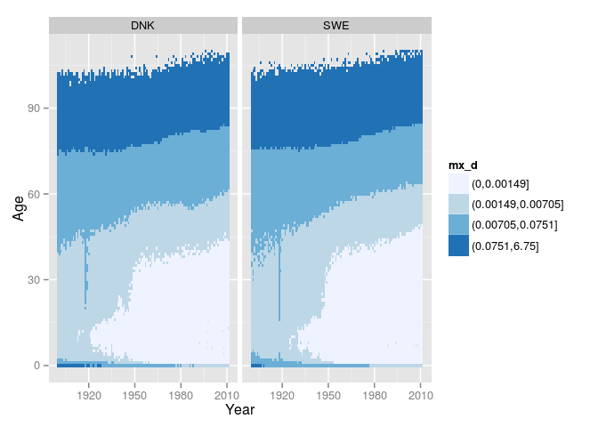
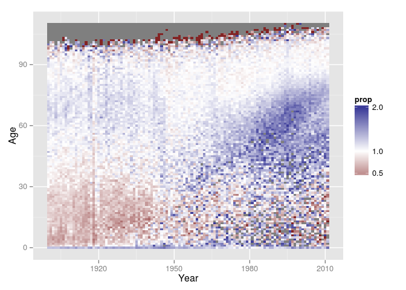
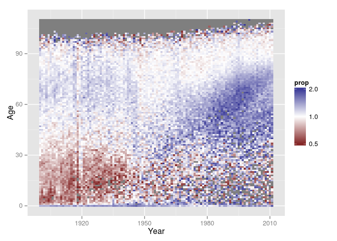
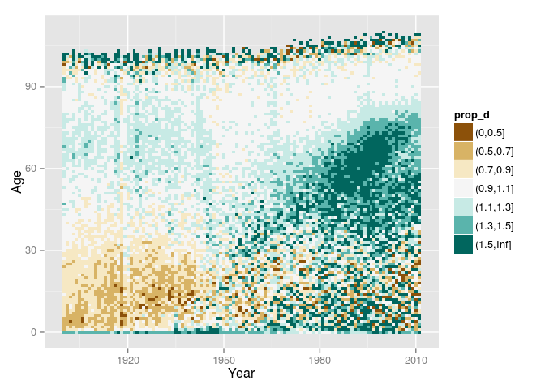
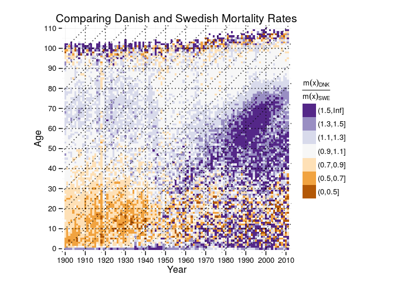

``` r
library(ggplot2) # our plotting package
library(tidyr)   # for reshaping between wide and long format
library(dplyr)   # for general data transformation
```

    ## 
    ## Attaching package: 'dplyr'
    ## 
    ## The following object is masked from 'package:stats':
    ## 
    ##     filter
    ## 
    ## The following objects are masked from 'package:base':
    ## 
    ##     intersect, setdiff, setequal, union

Sequential Colour Scale: Plotting Magnitudes
--------------------------------------------

Danish and Swedish Female Period Death and Population Counts. Taken from the Human Mortality Database.

``` r
load(file = "../../data/dnk_swe_fem_hmd.Rdata")

head(dnk_swe_fem_hmd)
```

    ## Source: local data frame [6 x 5]
    ## 
    ##   Country Year Age      Dx       Nx
    ## 1     DNK 1900   0 4067.00 32511.27
    ## 2     DNK 1900   1  585.00 30311.81
    ## 3     DNK 1900   2  268.00 29520.55
    ## 4     DNK 1900   3  192.00 29273.95
    ## 5     DNK 1900   4  150.00 28714.20
    ## 6     DNK 1900   5  125.57 27663.03

Add mortality rates and quantile-cut mortality rates to data frame.

``` r
dnk_swe_fem_hmd %>%
  mutate(mx = Dx / Nx,
         mx_d = cut(mx, breaks = quantile(mx, na.rm = TRUE))) -> mort

head(mort)
```

    ## Source: local data frame [6 x 7]
    ## 
    ##   Country Year Age      Dx       Nx          mx              mx_d
    ## 1     DNK 1900   0 4067.00 32511.27 0.125095082     (0.0751,6.75]
    ## 2     DNK 1900   1  585.00 30311.81 0.019299408  (0.00705,0.0751]
    ## 3     DNK 1900   2  268.00 29520.55 0.009078422  (0.00705,0.0751]
    ## 4     DNK 1900   3  192.00 29273.95 0.006558732 (0.00149,0.00705]
    ## 5     DNK 1900   4  150.00 28714.20 0.005223896 (0.00149,0.00705]
    ## 6     DNK 1900   5  125.57 27663.03 0.004539271 (0.00149,0.00705]

A heatmap of mortality rates for Swedish and Danish females over period and age (Period Lexis-surface). The mortality rates are cut into quantiles.

``` r
ggplot(mort) +
  geom_tile(aes(x = Year, y = Age, fill = mx_d)) +
  # Use a sequential scale created by colour expert Cynthia Brewer
  scale_fill_brewer(type = "seq") +
  # Create small multiples by country.
  facet_wrap(~ Country)
```



Divergent Colour Scale: Plotting Differences and Proportions
------------------------------------------------------------

We compute the proportions of Danish and Swedish mortality rates at each period-age crossing.

``` r
mort %>%
  # Remove Dx, Nx and mx_d, otherwise `spread` gets confused. It only accepts a
  # single value column (mx in our case)
  select(-Dx, -Nx, -mx_d) %>%
  # Convert to "wide" format in order to make it easier to compute proportions.
  spread(key = Country, value = mx) %>%
  # Compute continuous and discrete proportions of mortality rates.
  mutate(prop = DNK / SWE) -> diffmort

diffmort
```

    ## Source: local data frame [12,432 x 5]
    ## 
    ##    Year Age         DNK         SWE      prop
    ## 1  1900   0 0.125095082 0.095587408 1.3086983
    ## 2  1900   1 0.019299408 0.028156634 0.6854302
    ## 3  1900   2 0.009078422 0.014878657 0.6101640
    ## 4  1900   3 0.006558732 0.010079411 0.6507059
    ## 5  1900   4 0.005223896 0.008491402 0.6151983
    ## 6  1900   5 0.004539271 0.006933225 0.6547128
    ## 7  1900   6 0.004156291 0.005787205 0.7181863
    ## 8  1900   7 0.003879034 0.004611747 0.8411202
    ## 9  1900   8 0.003694223 0.005123460 0.7210405
    ## 10 1900   9 0.003567067 0.004475198 0.7970748
    ## ..  ... ...         ...         ...       ...

Plot the mortality proportions using a continuous divergent colour scale.

``` r
ggplot(diffmort) +
  geom_tile(aes(x = Year, y = Age, fill = prop)) +
  scale_fill_gradient2(
    # Lower limit of the colour scale should be half-mortality.
    # Upper limit should be double-mortality.
    limits = c(0.5, 2),
    breaks = c(0.5, 1, 2),
    # Note that we set the midpoint of our divergent colour scale to 1.
    midpoint = 1)
```



We face the problem that our colour scale is not symmetric on a multaplicative level (where half and double are equally distanced from 1). We can fix that with a logarithmic scale transformation. Not that we have to reset the midpoint when we use a log-transform on our colour scale (log2(1) = 0).

``` r
ggplot(diffmort) +
  geom_tile(aes(x = Year, y = Age, fill = prop)) +
  scale_fill_gradient2(
    limits = c(0.5, 2),
    breaks = c(0.5, 1, 2),
    midpoint = 0, trans = "log2")
```



A good alternative is to build the symmetric scale yourself and use discrete value categories. These are the breaks we will use to cut our data.

``` r
breaks <- c(0, 0.5, 0.7, 0.9, 1.1, 1.3, 1.5, Inf)
diffmort %>%
  mutate(prop_d = cut(prop, breaks = breaks)) -> diffmort

ggplot(diffmort) +
  geom_tile(aes(x = Year, y = Age, fill = prop_d)) +
  scale_fill_brewer(type = "div")
```



Now let's get all out insane and add all the niceties to our plot to make it "publication ready".

``` r
ggplot(diffmort) +
  geom_tile(aes(x = Year, y = Age,
                fill = prop_d)) +
  # add age, period, and cohort guidelines for every 10 years
  geom_vline(xintercept = seq(1910, 2000, 10),
             colour = "black", size = 0.5, lty = 3) +
  geom_hline(yintercept = seq(10, 100, 10),
             colour = "black", size = 0.5, lty = 3) +
  geom_abline(intercept = seq(-100, 110, 10) - 1910,
              colour = "black", size = 0.5, lty = 3) +
  # Add one of Brewers "divergent" colour scales.
  scale_fill_brewer(
    # Use math annotation in scale title.
    # See `help(plotmath)` for more information.
    name = expression(frac(m(x)[DNK], m(x)[SWE])),
    type = "div", palette = 4) +
  # Reverse the order of the legend.
  guides(fill = guide_legend(reverse = TRUE)) +
  # Change the labels on the x and y scales to
  # correspond to the Lexis grid and reduce the
  # extra space ggplot draws around the plot.
  scale_x_continuous(breaks = seq(1900, 2010, 10), expand = c(0.01, 0)) +
  scale_y_continuous(breaks = seq(0, 110, 10), expand = c(0.01, 0)) +
  # Scale the x and the y axis equally so that a
  # cohort line is at a 45° angle.
  coord_fixed() +
  # Add a title
  ggtitle("Comparing Danish and Swedish Mortality Rates") +
  # Use a very minimal theme.
  theme_minimal()
```


