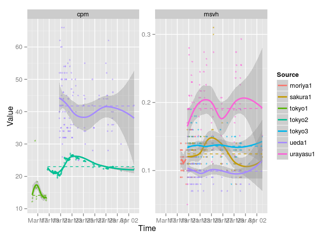
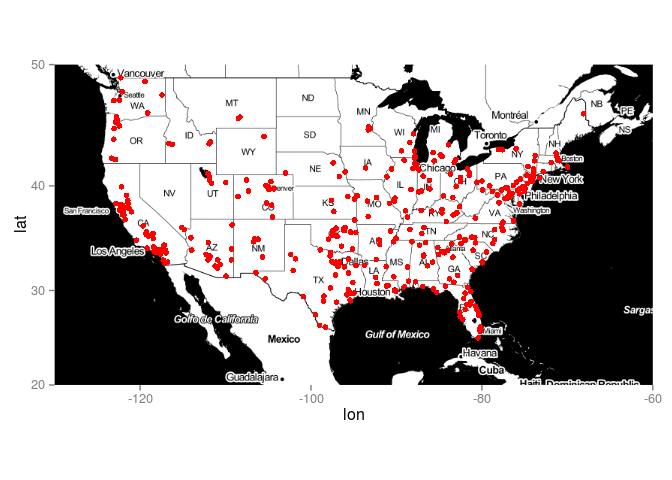
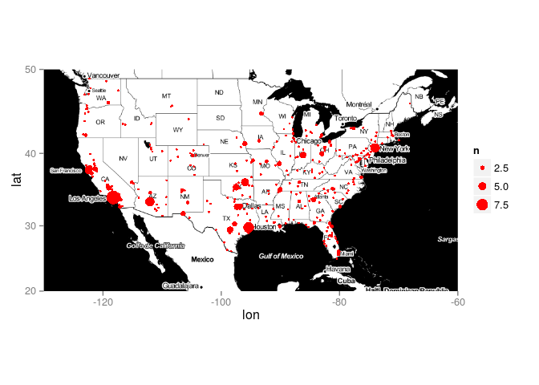
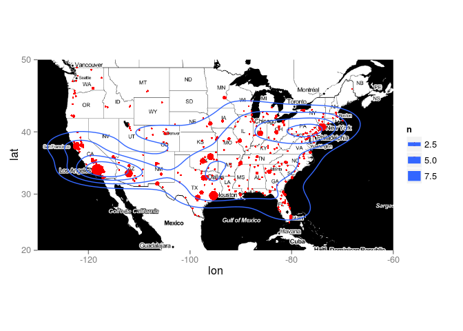
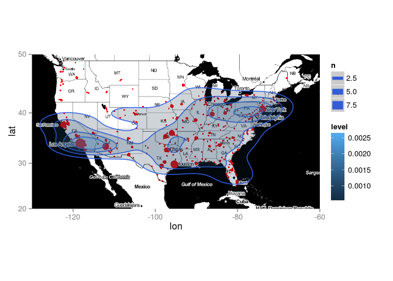
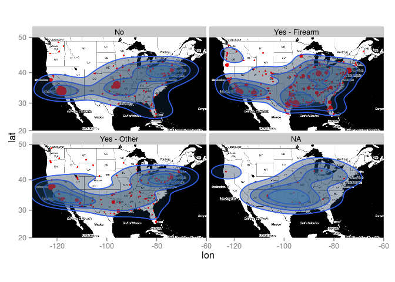

``` r
library(ggplot2)   # our plotting package
library(tidyr)     # for reshaping between wide and long format
library(dplyr)     # for general data transformation
library(ggmap)     # using googlemaps (and other) in plots
library(lubridate) # working with dates
```

Case Study 1. The Fukushima Nuclear Disaster.
---------------------------------------------

During the Fukushima nuclear disaster in 2011 private individuals streamed their Geiger counter readings via webcam to the internet. This dataset contains readings from some of these web-streams over time. Note that these are not official readings but readings provided by private individuals.

``` r
fukushima <- read.csv("../../data/fukushima.csv",
                      skip = 8, stringsAsFactors = FALSE)

head(fukushima)
```

    ##   Source                 Time Value Unit
    ## 1 tokyo1 2011-03-16 00:44 CET  12.2  cpm
    ## 2 tokyo1 2011-03-16 01:46 CET  13.3  cpm
    ## 3 tokyo1 2011-03-16 12:42 CET  31.0  cpm
    ## 4 tokyo1 2011-03-16 14:18 CET  17.2  cpm
    ## 5 tokyo1 2011-03-16 15:16 CET  16.7  cpm
    ## 6 tokyo1 2011-03-16 16:06 CET  16.3  cpm

Convert the Time variable to R-date-time format.

``` r
fukushima %>%
  mutate(Time = parse_date_time(Time,
                                orders = "%Y%m%d %H%M",
                                tz = "CET")) -> fukushima
```

Plot smoothed timelines of radiation levels.

``` r
ggplot(fukushima, aes(x = Time, y = Value, group = Source, colour = Source)) +
  # The raw data is displayed as points.
  geom_point(alpha = 0.5, size = 1.2) +
  # We apply smoothing to each timeline.
  geom_smooth(size = 1) +
  # The mean radiation level for each timeline is added.
  geom_line(stat = "hline", yintercept = "mean", lty = 2) +
  # We have separate panels for each unit of measurement.
  facet_wrap(~ Unit, scales = "free_y")
```



Guardian: The Counted
---------------------

Source: <http://www.theguardian.com/thecounted>

``` r
counted <- read.csv("../../data/the_counted.csv",
                    na.strings = "Unknown",
                    stringsAsFactors = FALSE)

uspop <- read.csv("../../data/uspop_2014.csv",
                  skip = 8, stringsAsFactors = FALSE)

RecodeArmed <- function (x) {
  x <- ifelse(x == "Disputed", NA, x)
  x <- ifelse(x == "Firearm", "Yes - Firearm", x)
  x <- ifelse(x != "No" & x != "Yes - Firearm", "Yes - Other", x)
  x
}

counted %>%
  mutate(citystate = paste(city, state),
         armed_simple = RecodeArmed(armed),
         time = paste(month, day, year),
         time = parse_date_time(time, orders = "%B %d! %Y!")) %>%
  bind_cols(., geocode(.$citystate, messaging = FALSE)) %>%
  inner_join(., uspop, by = c("state" = "Short")) -> killed

usmap <- get_map(location = c(-130, 20, -60, 50), maptype = "toner")
```

    ## maptype = "toner" is only available with source = "stamen".
    ## resetting to source = "stamen"...
    ## Map from URL : http://tile.stamen.com/toner/4/2/5.png

    ## Warning in file.remove(index[[url]]): cannot remove file
    ## '849a8a6c3946f1ceacae7444c9c37748.rds', reason 'No such file or directory'

    ## Map from URL : http://tile.stamen.com/toner/4/3/5.png

    ## Warning in file.remove(index[[url]]): cannot remove file
    ## '640c34bb77fa3ad78613541651554d2b.rds', reason 'No such file or directory'

    ## Map from URL : http://tile.stamen.com/toner/4/4/5.png

    ## Warning in file.remove(index[[url]]): cannot remove file
    ## 'b917257a97931b6a346b2cc7331d2012.rds', reason 'No such file or directory'

    ## Map from URL : http://tile.stamen.com/toner/4/5/5.png

    ## Warning in file.remove(index[[url]]): cannot remove file
    ## 'daf1136fa2af656f300ff8220f928c7d.rds', reason 'No such file or directory'

    ## Map from URL : http://tile.stamen.com/toner/4/2/6.png

    ## Warning in file.remove(index[[url]]): cannot remove file
    ## '32bdf056867156c15ab522fe4bc8b58c.rds', reason 'No such file or directory'

    ## Map from URL : http://tile.stamen.com/toner/4/3/6.png

    ## Warning in file.remove(index[[url]]): cannot remove file
    ## '6219a87c5222996db2f6ecebe72cfbce.rds', reason 'No such file or directory'

    ## Map from URL : http://tile.stamen.com/toner/4/4/6.png

    ## Warning in file.remove(index[[url]]): cannot remove file
    ## '3f21985041482871a0b47a128dd2f5b5.rds', reason 'No such file or directory'

    ## Map from URL : http://tile.stamen.com/toner/4/5/6.png

    ## Warning in file.remove(index[[url]]): cannot remove file
    ## '196a9a87afbe0ffdb1f0dd658d1cc816.rds', reason 'No such file or directory'

    ## Map from URL : http://tile.stamen.com/toner/4/2/7.png

    ## Warning in file.remove(index[[url]]): cannot remove file
    ## 'eb5e54f385ddfeffc9884f6e70b42239.rds', reason 'No such file or directory'

    ## Map from URL : http://tile.stamen.com/toner/4/3/7.png

    ## Warning in file.remove(index[[url]]): cannot remove file
    ## 'f8dff1675c802da516db365122ea7a2d.rds', reason 'No such file or directory'

    ## Map from URL : http://tile.stamen.com/toner/4/4/7.png

    ## Warning in file.remove(index[[url]]): cannot remove file
    ## '8e1b952f41399bdfc3b4222a747488a5.rds', reason 'No such file or directory'

    ## Map from URL : http://tile.stamen.com/toner/4/5/7.png

    ## Warning in file.remove(index[[url]]): cannot remove file
    ## 'ffc233eb5f5de7321b3988b3691f4418.rds', reason 'No such file or directory'

``` r
ggmap(usmap) +
  geom_point(data = killed,
             aes(x = lon, y = lat),
             colour = "red")
```

    ## Warning in loop_apply(n, do.ply): Removed 7 rows containing missing values
    ## (geom_point).



``` r
ggmap(usmap) +
  geom_point(data = killed,
             aes(x = lon, y = lat, size = ..n..),
             stat = "sum",
             colour = "red")
```

    ## Warning in loop_apply(n, do.ply): Removed 3 rows containing missing values
    ## (geom_point).



``` r
plot_killed +
  geom_point(data = killed,
             aes(x = lon, y = lat, size = ..n..),
             stat = "sum",
             colour = "red") +
  geom_density2d(data = killed,
                 aes(x = lon, y = lat),
                 bins = 5)
```

    ## Warning in loop_apply(n, do.ply): Removed 7 rows containing non-finite
    ## values (stat_density2d).

    ## Warning in loop_apply(n, do.ply): Removed 7 rows containing non-finite
    ## values (stat_density2d).

    ## Warning in loop_apply(n, do.ply): Removed 7 rows containing non-finite
    ## values (stat_density2d).

    ## Warning in loop_apply(n, do.ply): Removed 3 rows containing missing values
    ## (geom_point).

    ## Warning in loop_apply(n, do.ply): Removed 3 rows containing missing values
    ## (geom_point).



``` r
plot_killed +
  geom_point(data = killed,
             aes(x = lon, y = lat, size = ..n..),
             stat = "sum",
             colour = "red") +
  geom_density2d(data = killed,
                 aes(x = lon, y = lat),
                 bins = 5) +
  geom_polygon(data = killed,
               aes(x = lon, y = lat, fill = ..level..),
               stat = "density2d",
               bins = 5,
               alpha = 0.2)
```

    ## Warning in loop_apply(n, do.ply): Removed 7 rows containing non-finite
    ## values (stat_density2d).

    ## Warning in loop_apply(n, do.ply): Removed 7 rows containing non-finite
    ## values (stat_density2d).

    ## Warning in loop_apply(n, do.ply): Removed 7 rows containing non-finite
    ## values (stat_density2d).

    ## Warning in loop_apply(n, do.ply): Removed 7 rows containing non-finite
    ## values (stat_density2d).

    ## Warning in loop_apply(n, do.ply): Removed 3 rows containing missing values
    ## (geom_point).

    ## Warning in loop_apply(n, do.ply): Removed 3 rows containing missing values
    ## (geom_point).



``` r
plot_killed +
  geom_point(data = killed,
             aes(x = lon, y = lat, size = ..n..),
             stat = "sum",
             colour = "red") +
  geom_density2d(data = killed,
                 aes(x = lon, y = lat),
                 bins = 5) +
  geom_polygon(data = killed,
               aes(x = lon, y = lat, fill = ..level..),
               stat = "density2d",
               bins = 5,
               alpha = 0.2) +
  facet_wrap(~ armed_simple) +
  guides(fill = FALSE, size = FALSE)
```

    ## Warning in loop_apply(n, do.ply): Removed 5 rows containing non-finite
    ## values (stat_density2d).

    ## Warning in loop_apply(n, do.ply): Removed 2 rows containing non-finite
    ## values (stat_density2d).

    ## Warning in loop_apply(n, do.ply): Removed 5 rows containing non-finite
    ## values (stat_density2d).

    ## Warning in loop_apply(n, do.ply): Removed 2 rows containing non-finite
    ## values (stat_density2d).

    ## Warning in loop_apply(n, do.ply): Removed 5 rows containing non-finite
    ## values (stat_density2d).

    ## Warning in loop_apply(n, do.ply): Removed 2 rows containing non-finite
    ## values (stat_density2d).

    ## Warning in loop_apply(n, do.ply): Removed 5 rows containing non-finite
    ## values (stat_density2d).

    ## Warning in loop_apply(n, do.ply): Removed 2 rows containing non-finite
    ## values (stat_density2d).

    ## Warning in loop_apply(n, do.ply): Removed 3 rows containing missing values
    ## (geom_point).

    ## Warning in loop_apply(n, do.ply): Removed 2 rows containing missing values
    ## (geom_point).

    ## Warning in loop_apply(n, do.ply): Removed 3 rows containing missing values
    ## (geom_point).

    ## Warning in loop_apply(n, do.ply): Removed 2 rows containing missing values
    ## (geom_point).



``` r
killed %>%
  group_by(State, armed_simple) %>%
  summarise(deaths = n(),
            population = unique(Population)) %>%
  ungroup() %>%
  mutate(rate = deaths / population * 1E6,
         state = tolower(State)) %>%
  select(-State) -> killed_aggr

us_states_border <- map_data("state")

left_join(x = us_states_border, y = killed_aggr,
          by = c("region" = "state")) -> killed_aggr_map

ggmap(usmap) +
  geom_polygon(data = killed_aggr_map,
               aes(x = long, y = lat, group = group,
                   fill = cut(rate, breaks = seq(0, 3, 1))),
               alpha = 0.5) +
  geom_point(data = killed,
             aes(x = lon, y = lat, size = ..n..),
             colour = "red", alpha = 0.4,
             stat = "sum") +
  facet_wrap(~ armed_simple) +
  scale_fill_brewer(name = "People Killed\nper Million",
                    type = "seq", palette = 9) +
  scale_size(name = "Cases of\nPeople Killed", range = c(2, 10))
```

    ## Warning in loop_apply(n, do.ply): Removed 3 rows containing missing values
    ## (geom_point).

    ## Warning in loop_apply(n, do.ply): Removed 2 rows containing missing values
    ## (geom_point).


