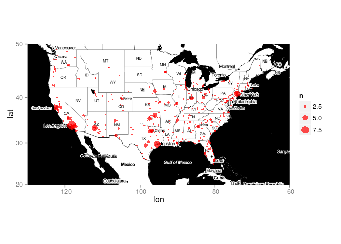
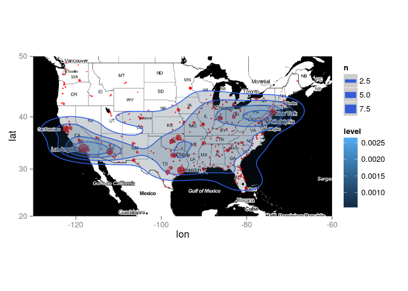
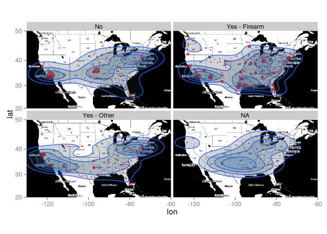
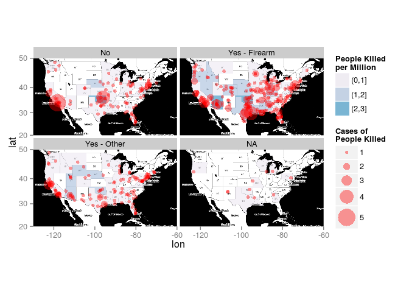

``` r
library(ggplot2)   # our plotting package
library(tidyr)     # for reshaping between wide and long format
library(dplyr)     # for general data transformation
```

    ## 
    ## Attaching package: 'dplyr'
    ## 
    ## The following object is masked from 'package:stats':
    ## 
    ##     filter
    ## 
    ## The following objects are masked from 'package:base':
    ## 
    ##     intersect, setdiff, setequal, union

``` r
library(ggmap)     # using googlemaps (and other) in plots
```

    ## Google Maps API Terms of Service: http://developers.google.com/maps/terms.
    ## Please cite ggmap if you use it: see citation('ggmap') for details.

``` r
library(lubridate) # working with dates
```

Case Study 1. The Fukushima Nuclear Disaster.
---------------------------------------------

During the Fukushima nuclear disaster in 2011 private individuals streamed their Geiger counter readings via webcam to the internet. This dataset contains readings from some of these web-streams over time. Note that these are not official readings but readings provided by private individuals.

``` r
fukushima <- read.csv("../../data/fukushima.csv",
                      skip = 8, stringsAsFactors = FALSE)

head(fukushima)
```

    ##   Source                 Time Value Unit
    ## 1 tokyo1 2011-03-16 00:44 CET  12.2  cpm
    ## 2 tokyo1 2011-03-16 01:46 CET  13.3  cpm
    ## 3 tokyo1 2011-03-16 12:42 CET  31.0  cpm
    ## 4 tokyo1 2011-03-16 14:18 CET  17.2  cpm
    ## 5 tokyo1 2011-03-16 15:16 CET  16.7  cpm
    ## 6 tokyo1 2011-03-16 16:06 CET  16.3  cpm

Convert the Time variable to R-date-time format.

``` r
fukushima %>%
  mutate(Time = parse_date_time(Time,
                                orders = "%Y%m%d %H%M",
                                tz = "CET")) -> fukushima
```

Plot smoothed timelines of radiation levels.

``` r
ggplot(fukushima, aes(x = Time, y = Value, group = Source, colour = Source)) +
  # The raw data is displayed as points.
  geom_point(alpha = 0.5, size = 1.2) +
  # We apply smoothing to each timeline.
  geom_smooth(size = 1) +
  # The mean radiation level for each timeline is added.
  geom_line(stat = "hline", yintercept = "mean", lty = 2) +
  # We have separate panels for each unit of measurement.
  facet_wrap(~ Unit, scales = "free_y")
```


Guardian: The Counted
---------------------

The British newspaper "The Guardian" assembled a database of people killed by police in the US in 2015. Source: <http://www.theguardian.com/thecounted> Read the data. Note that the strings should not be automatically converted to factor variables.

``` r
counted <- read.csv("../../data/the_counted.csv",
                    na.strings = "Unknown",
                    stringsAsFactors = FALSE)
head(counted)
```

    ##                name age gender   raceethnicity   month day year
    ## 1   Roberto Ornelas  18   Male Hispanic/Latino January   1 2015
    ## 2   Matthew Ajibade  22   Male           Black January   1 2015
    ## 3     Garrett Gagne  22   Male           White January   1 2015
    ## 4      Lewis Lembke  47   Male           White January   2 2015
    ## 5 Michael Kocher Jr  19   Male           White January   3 2015
    ## 6     John Quintero  23   Male Hispanic/Latino January   3 2015
    ##               streetaddress      city state             cause
    ## 1           39 N Marlin Ave Key Largo    FL              <NA>
    ## 2      1050 Carl Griffin Dr  Savannah    GA  Death in custody
    ## 3 Crowell Rd and Tipcart Dr   Chatham    MA Struck by vehicle
    ## 4      4505 SW Masters Loop     Aloha    OR           Gunshot
    ## 5        2600 Kaumualii Hwy Kaumakani    HI Struck by vehicle
    ## 6      500 North Oliver Ave   Wichita    KS           Gunshot
    ##                 lawenforcementagency   armed
    ## 1     Monroe County Sheriff's Office      No
    ## 2    Chatham County Sheriff's Office      No
    ## 3          Chatham Police Department      No
    ## 4 Washington County Sheriff's Office Firearm
    ## 5            Kauai Police Department      No
    ## 6          Wichita Police Department      No

Use Google Maps API to get latitude and longitude for each of the places in the dataset. This is completely automated, but takes some time and is limited by Google to 2500 map requests per day per IP. The `geocode` function is part of the `ggmap` package.

``` r
counted %>%
  mutate(citystate = paste(city, state)) %>%
  bind_cols(., geocode(.$citystate)) -> killed
```

    ## Information from URL : http://maps.googleapis.com/maps/api/geocode/json?address=Key+Largo+FL&sensor=false
    ## Information from URL : http://maps.googleapis.com/maps/api/geocode/json?address=Savannah+GA&sensor=false
    ## Information from URL : http://maps.googleapis.com/maps/api/geocode/json?address=Chatham+MA&sensor=false
    ## Information from URL : http://maps.googleapis.com/maps/api/geocode/json?address=Aloha+OR&sensor=false
    ## Information from URL : http://maps.googleapis.com/maps/api/geocode/json?address=Kaumakani+HI&sensor=false
    ## Information from URL : http://maps.googleapis.com/maps/api/geocode/json?address=Wichita+KS&sensor=false
    ## Information from URL : http://maps.googleapis.com/maps/api/geocode/json?address=Shelton+WA&sensor=false
    ## Information from URL : http://maps.googleapis.com/maps/api/geocode/json?address=San+Francisco+CA&sensor=false
    ## Information from URL : http://maps.googleapis.com/maps/api/geocode/json?address=Chandler+AZ&sensor=false
    ## Information from URL : http://maps.googleapis.com/maps/api/geocode/json?address=Evans+CO&sensor=false
    ## .Information from URL : http://maps.googleapis.com/maps/api/geocode/json?address=Stockton+CA&sensor=false
    ## .Information from URL : http://maps.googleapis.com/maps/api/geocode/json?address=Los+Angeles+CA&sensor=false
    ## .Information from URL : http://maps.googleapis.com/maps/api/geocode/json?address=Burlington+IA&sensor=false
    ## .Information from URL : http://maps.googleapis.com/maps/api/geocode/json?address=Assaria+KS&sensor=false
    ## .Information from URL : http://maps.googleapis.com/maps/api/geocode/json?address=Pittsburgh+PA&sensor=false
    ## .Information from URL : http://maps.googleapis.com/maps/api/geocode/json?address=Des+Moines+IA&sensor=false
    ## .Information from URL : http://maps.googleapis.com/maps/api/geocode/json?address=Rosemont+IL&sensor=false
    ## .Information from URL : http://maps.googleapis.com/maps/api/geocode/json?address=Freeport+TX&sensor=false
    ## .Information from URL : http://maps.googleapis.com/maps/api/geocode/json?address=New+Orleans+LA&sensor=false
    ## Information from URL : http://maps.googleapis.com/maps/api/geocode/json?address=Norfolk+NE&sensor=false
    ## .Information from URL : http://maps.googleapis.com/maps/api/geocode/json?address=Huntley+MT&sensor=false
    ## .Information from URL : http://maps.googleapis.com/maps/api/geocode/json?address=Strong+AR&sensor=false
    ## .Information from URL : http://maps.googleapis.com/maps/api/geocode/json?address=Salt+Lake+City+UT&sensor=false
    ## .Information from URL : http://maps.googleapis.com/maps/api/geocode/json?address=Syracuse+UT&sensor=false
    ## .Information from URL : http://maps.googleapis.com/maps/api/geocode/json?address=El+Paso+TX&sensor=false
    ## .Information from URL : http://maps.googleapis.com/maps/api/geocode/json?address=England+AR&sensor=false
    ## .Information from URL : http://maps.googleapis.com/maps/api/geocode/json?address=South+Gate+CA&sensor=false
    ## .Information from URL : http://maps.googleapis.com/maps/api/geocode/json?address=Las+Vegas+NV&sensor=false
    ## .Information from URL : http://maps.googleapis.com/maps/api/geocode/json?address=Arcola+IL&sensor=false
    ## Information from URL : http://maps.googleapis.com/maps/api/geocode/json?address=Albuquerque+NM&sensor=false
    ## .Information from URL : http://maps.googleapis.com/maps/api/geocode/json?address=Jourdanton+TX&sensor=false
    ## .Information from URL : http://maps.googleapis.com/maps/api/geocode/json?address=St+Paul+MN&sensor=false
    ## .Information from URL : http://maps.googleapis.com/maps/api/geocode/json?address=Robertsville+MO&sensor=false
    ## .Information from URL : http://maps.googleapis.com/maps/api/geocode/json?address=Draper+UT&sensor=false
    ## .Information from URL : http://maps.googleapis.com/maps/api/geocode/json?address=Lake+Jackson+TX&sensor=false
    ## .Information from URL : http://maps.googleapis.com/maps/api/geocode/json?address=Old+Bridge+Township+NJ&sensor=false
    ## .Information from URL : http://maps.googleapis.com/maps/api/geocode/json?address=Catskill+NY&sensor=false
    ## .Information from URL : http://maps.googleapis.com/maps/api/geocode/json?address=Bloomington+MN&sensor=false
    ## .Information from URL : http://maps.googleapis.com/maps/api/geocode/json?address=Indianapolis+IN&sensor=false
    ## Information from URL : http://maps.googleapis.com/maps/api/geocode/json?address=Ville+Platte+LA&sensor=false
    ## .Information from URL : http://maps.googleapis.com/maps/api/geocode/json?address=Chesapeake+VA&sensor=false
    ## .Information from URL : http://maps.googleapis.com/maps/api/geocode/json?address=Fairfield+CA&sensor=false
    ## .Information from URL : http://maps.googleapis.com/maps/api/geocode/json?address=Scottsdale+AZ&sensor=false
    ## .Information from URL : http://maps.googleapis.com/maps/api/geocode/json?address=Tulsa+OK&sensor=false
    ## .Information from URL : http://maps.googleapis.com/maps/api/geocode/json?address=Aurora+CO&sensor=false
    ## .Information from URL : http://maps.googleapis.com/maps/api/geocode/json?address=Fremont+CA&sensor=false
    ## .Information from URL : http://maps.googleapis.com/maps/api/geocode/json?address=Minneapolis+MN&sensor=false
    ## .Information from URL : http://maps.googleapis.com/maps/api/geocode/json?address=Stanford+KY&sensor=false
    ## .Information from URL : http://maps.googleapis.com/maps/api/geocode/json?address=Houston+TX&sensor=false
    ## Information from URL : http://maps.googleapis.com/maps/api/geocode/json?address=Mabank+TX&sensor=false
    ## .Information from URL : http://maps.googleapis.com/maps/api/geocode/json?address=Muskogee+OK&sensor=false
    ## .Information from URL : http://maps.googleapis.com/maps/api/geocode/json?address=Fort+Worth+TX&sensor=false
    ## .Information from URL : http://maps.googleapis.com/maps/api/geocode/json?address=Maricopa+AZ&sensor=false
    ## .Information from URL : http://maps.googleapis.com/maps/api/geocode/json?address=Gunlock+KY&sensor=false
    ## .Information from URL : http://maps.googleapis.com/maps/api/geocode/json?address=Weymouth+MA&sensor=false
    ## .Information from URL : http://maps.googleapis.com/maps/api/geocode/json?address=St+Louis+MO&sensor=false
    ## .Information from URL : http://maps.googleapis.com/maps/api/geocode/json?address=Hemet+CA&sensor=false
    ## .Information from URL : http://maps.googleapis.com/maps/api/geocode/json?address=Roma+TX&sensor=false
    ## .Information from URL : http://maps.googleapis.com/maps/api/geocode/json?address=Robinsonville+MS&sensor=false
    ## Information from URL : http://maps.googleapis.com/maps/api/geocode/json?address=Derry+NH&sensor=false
    ## .Information from URL : http://maps.googleapis.com/maps/api/geocode/json?address=Longview+TX&sensor=false
    ## .Information from URL : http://maps.googleapis.com/maps/api/geocode/json?address=Sierra+Blanca+TX&sensor=false
    ## .Information from URL : http://maps.googleapis.com/maps/api/geocode/json?address=Lauderhill+FL&sensor=false
    ## .Information from URL : http://maps.googleapis.com/maps/api/geocode/json?address=Levelland+TX&sensor=false
    ## .Information from URL : http://maps.googleapis.com/maps/api/geocode/json?address=Austin+TX&sensor=false
    ## .Information from URL : http://maps.googleapis.com/maps/api/geocode/json?address=Baltimore+MD&sensor=false
    ## .Information from URL : http://maps.googleapis.com/maps/api/geocode/json?address=Rexburg+ID&sensor=false
    ## .Information from URL : http://maps.googleapis.com/maps/api/geocode/json?address=Pueblo+CO&sensor=false
    ## .Information from URL : http://maps.googleapis.com/maps/api/geocode/json?address=Berlin+NJ&sensor=false
    ## Information from URL : http://maps.googleapis.com/maps/api/geocode/json?address=Denver+CO&sensor=false
    ## .Information from URL : http://maps.googleapis.com/maps/api/geocode/json?address=Wasco+CA&sensor=false
    ## .Information from URL : http://maps.googleapis.com/maps/api/geocode/json?address=Phoenix+AZ&sensor=false
    ## .Information from URL : http://maps.googleapis.com/maps/api/geocode/json?address=Morenci+AZ&sensor=false
    ## .Information from URL : http://maps.googleapis.com/maps/api/geocode/json?address=Columbus+OH&sensor=false
    ## .Information from URL : http://maps.googleapis.com/maps/api/geocode/json?address=Rosenberg+TX&sensor=false
    ## .Information from URL : http://maps.googleapis.com/maps/api/geocode/json?address=Anchorage+AK&sensor=false
    ## .Information from URL : http://maps.googleapis.com/maps/api/geocode/json?address=Sunset+TX&sensor=false
    ## .Information from URL : http://maps.googleapis.com/maps/api/geocode/json?address=Forth+Worth+TX&sensor=false
    ## .Information from URL : http://maps.googleapis.com/maps/api/geocode/json?address=Stillwater+OK&sensor=false
    ## Information from URL : http://maps.googleapis.com/maps/api/geocode/json?address=Omaha+NE&sensor=false
    ## .Information from URL : http://maps.googleapis.com/maps/api/geocode/json?address=Billings+MT&sensor=false
    ## .Information from URL : http://maps.googleapis.com/maps/api/geocode/json?address=Randallstown+MD&sensor=false
    ## .Information from URL : http://maps.googleapis.com/maps/api/geocode/json?address=Apple+Valley+CA&sensor=false
    ## .Information from URL : http://maps.googleapis.com/maps/api/geocode/json?address=Hanover+PA&sensor=false
    ## .Information from URL : http://maps.googleapis.com/maps/api/geocode/json?address=Guthrie+OK&sensor=false
    ## .Information from URL : http://maps.googleapis.com/maps/api/geocode/json?address=Antioch+CA&sensor=false
    ## .Information from URL : http://maps.googleapis.com/maps/api/geocode/json?address=Oakland+CA&sensor=false
    ## Information from URL : http://maps.googleapis.com/maps/api/geocode/json?address=Douglas+GA&sensor=false
    ## .Information from URL : http://maps.googleapis.com/maps/api/geocode/json?address=Memphis+TN&sensor=false
    ## Information from URL : http://maps.googleapis.com/maps/api/geocode/json?address=Orlando+FL&sensor=false
    ## .Information from URL : http://maps.googleapis.com/maps/api/geocode/json?address=Waco+TX&sensor=false
    ## .Information from URL : http://maps.googleapis.com/maps/api/geocode/json?address=Chino+CA&sensor=false
    ## .Information from URL : http://maps.googleapis.com/maps/api/geocode/json?address=Tallahassee+FL&sensor=false
    ## .Information from URL : http://maps.googleapis.com/maps/api/geocode/json?address=Electra+TX&sensor=false
    ## .Information from URL : http://maps.googleapis.com/maps/api/geocode/json?address=Calimesa+CA&sensor=false
    ## .Information from URL : http://maps.googleapis.com/maps/api/geocode/json?address=Oklahoma+City+OK&sensor=false
    ## .Information from URL : http://maps.googleapis.com/maps/api/geocode/json?address=Wyoming+MI&sensor=false
    ## Information from URL : http://maps.googleapis.com/maps/api/geocode/json?address=Gastonia+NC&sensor=false
    ## .Information from URL : http://maps.googleapis.com/maps/api/geocode/json?address=Fairfax+VA&sensor=false
    ## .Information from URL : http://maps.googleapis.com/maps/api/geocode/json?address=Nocona+TX&sensor=false
    ## .Information from URL : http://maps.googleapis.com/maps/api/geocode/json?address=Dallas+TX&sensor=false
    ## .Information from URL : http://maps.googleapis.com/maps/api/geocode/json?address=New+City+NY&sensor=false
    ## .Information from URL : http://maps.googleapis.com/maps/api/geocode/json?address=Pasco+WA&sensor=false
    ## .Information from URL : http://maps.googleapis.com/maps/api/geocode/json?address=Glenwood+Springs+CO&sensor=false
    ## .Information from URL : http://maps.googleapis.com/maps/api/geocode/json?address=Smyrna+ME&sensor=false
    ## .Information from URL : http://maps.googleapis.com/maps/api/geocode/json?address=San+Jose+CA&sensor=false
    ## .Information from URL : http://maps.googleapis.com/maps/api/geocode/json?address=Dadeville+AL&sensor=false
    ## Information from URL : http://maps.googleapis.com/maps/api/geocode/json?address=Port+St+Joe+FL&sensor=false
    ## .Information from URL : http://maps.googleapis.com/maps/api/geocode/json?address=Kansas+City+KS&sensor=false
    ## Information from URL : http://maps.googleapis.com/maps/api/geocode/json?address=San+Bernadino+CA&sensor=false
    ## .Information from URL : http://maps.googleapis.com/maps/api/geocode/json?address=Huntingdon+TN&sensor=false
    ## .Information from URL : http://maps.googleapis.com/maps/api/geocode/json?address=Reading+PA&sensor=false
    ## .Information from URL : http://maps.googleapis.com/maps/api/geocode/json?address=Essex+MD&sensor=false
    ## .Information from URL : http://maps.googleapis.com/maps/api/geocode/json?address=Laredo+TX&sensor=false
    ## .Information from URL : http://maps.googleapis.com/maps/api/geocode/json?address=Provo+UT&sensor=false
    ## .Information from URL : http://maps.googleapis.com/maps/api/geocode/json?address=Miami+Gardens+FL&sensor=false
    ## .Information from URL : http://maps.googleapis.com/maps/api/geocode/json?address=Colton+OR&sensor=false
    ## Information from URL : http://maps.googleapis.com/maps/api/geocode/json?address=Iuka+MS&sensor=false
    ## .Information from URL : http://maps.googleapis.com/maps/api/geocode/json?address=San+Manuel+AZ&sensor=false
    ## .Information from URL : http://maps.googleapis.com/maps/api/geocode/json?address=Bay+City+MI&sensor=false
    ## .Information from URL : http://maps.googleapis.com/maps/api/geocode/json?address=Boise+ID&sensor=false
    ## Information from URL : http://maps.googleapis.com/maps/api/geocode/json?address=Marana+AZ&sensor=false
    ## .Information from URL : http://maps.googleapis.com/maps/api/geocode/json?address=Tewksbury+MA&sensor=false
    ## Information from URL : http://maps.googleapis.com/maps/api/geocode/json?address=Eaton+Rapids+Township+MI&sensor=false
    ## .Information from URL : http://maps.googleapis.com/maps/api/geocode/json?address=Del+Rio+TX&sensor=false
    ## Information from URL : http://maps.googleapis.com/maps/api/geocode/json?address=Springfield+MO&sensor=false
    ## .Information from URL : http://maps.googleapis.com/maps/api/geocode/json?address=Charlotte+NC&sensor=false
    ## Information from URL : http://maps.googleapis.com/maps/api/geocode/json?address=Marysville+CA&sensor=false
    ## .Information from URL : http://maps.googleapis.com/maps/api/geocode/json?address=Euless+TX&sensor=false
    ## .Information from URL : http://maps.googleapis.com/maps/api/geocode/json?address=Birmingham+AL&sensor=false
    ## .Information from URL : http://maps.googleapis.com/maps/api/geocode/json?address=Rudioso+NM&sensor=false
    ## Information from URL : http://maps.googleapis.com/maps/api/geocode/json?address=Clarkesville+GA&sensor=false
    ## .Information from URL : http://maps.googleapis.com/maps/api/geocode/json?address=Palm+Bay+FL&sensor=false
    ## .Information from URL : http://maps.googleapis.com/maps/api/geocode/json?address=Millbrook+AL&sensor=false
    ## .Information from URL : http://maps.googleapis.com/maps/api/geocode/json?address=Powder+Springs+GA&sensor=false
    ## .Information from URL : http://maps.googleapis.com/maps/api/geocode/json?address=Allentown+PA&sensor=false
    ## .Information from URL : http://maps.googleapis.com/maps/api/geocode/json?address=Denham+Springs+LA&sensor=false
    ## .Information from URL : http://maps.googleapis.com/maps/api/geocode/json?address=Green+Bay+WI&sensor=false
    ## Information from URL : http://maps.googleapis.com/maps/api/geocode/json?address=Terre+Haute+IN&sensor=false
    ## .Information from URL : http://maps.googleapis.com/maps/api/geocode/json?address=Moultrie+GA&sensor=false
    ## .Information from URL : http://maps.googleapis.com/maps/api/geocode/json?address=Lakeland+FL&sensor=false
    ## Information from URL : http://maps.googleapis.com/maps/api/geocode/json?address=Gulfport+MS&sensor=false
    ## .Information from URL : http://maps.googleapis.com/maps/api/geocode/json?address=Peltzer+SC&sensor=false
    ## .Information from URL : http://maps.googleapis.com/maps/api/geocode/json?address=Santa+Ana+CA&sensor=false
    ## .Information from URL : http://maps.googleapis.com/maps/api/geocode/json?address=Columbia+MO&sensor=false
    ## .Information from URL : http://maps.googleapis.com/maps/api/geocode/json?address=La+Paz+County+AZ&sensor=false
    ## .Information from URL : http://maps.googleapis.com/maps/api/geocode/json?address=Tarboro+NC&sensor=false
    ## .Information from URL : http://maps.googleapis.com/maps/api/geocode/json?address=Roxand+Township+MI&sensor=false
    ## Information from URL : http://maps.googleapis.com/maps/api/geocode/json?address=Tuscon+AZ&sensor=false
    ## .Information from URL : http://maps.googleapis.com/maps/api/geocode/json?address=Lucedale+MS&sensor=false
    ## Information from URL : http://maps.googleapis.com/maps/api/geocode/json?address=Waikoloa+Village+HI&sensor=false
    ## Information from URL : http://maps.googleapis.com/maps/api/geocode/json?address=Joliet+IL&sensor=false
    ## Information from URL : http://maps.googleapis.com/maps/api/geocode/json?address=Salisbury+MD&sensor=false
    ## .Information from URL : http://maps.googleapis.com/maps/api/geocode/json?address=Tempe+AZ&sensor=false
    ## .Information from URL : http://maps.googleapis.com/maps/api/geocode/json?address=Deltona+FL&sensor=false
    ## .Information from URL : http://maps.googleapis.com/maps/api/geocode/json?address=Lincoln+NE&sensor=false
    ## .Information from URL : http://maps.googleapis.com/maps/api/geocode/json?address=Burbank+CA&sensor=false
    ## .Information from URL : http://maps.googleapis.com/maps/api/geocode/json?address=Milwaukee+WI&sensor=false
    ## .Information from URL : http://maps.googleapis.com/maps/api/geocode/json?address=Madison+WI&sensor=false
    ## Information from URL : http://maps.googleapis.com/maps/api/geocode/json?address=Sulphur+Springs+TX&sensor=false
    ## .Information from URL : http://maps.googleapis.com/maps/api/geocode/json?address=Putnam+Hall+FL&sensor=false
    ## Information from URL : http://maps.googleapis.com/maps/api/geocode/json?address=Atlanta+GA&sensor=false
    ## .Information from URL : http://maps.googleapis.com/maps/api/geocode/json?address=Claymont+DE&sensor=false
    ## .Information from URL : http://maps.googleapis.com/maps/api/geocode/json?address=Anaheim+CA&sensor=false
    ## .Information from URL : http://maps.googleapis.com/maps/api/geocode/json?address=Cocoa+FL&sensor=false
    ## .Information from URL : http://maps.googleapis.com/maps/api/geocode/json?address=Craig+CO&sensor=false
    ## .Information from URL : http://maps.googleapis.com/maps/api/geocode/json?address=Penrose+NC&sensor=false
    ## .Information from URL : http://maps.googleapis.com/maps/api/geocode/json?address=Hackensack+NJ&sensor=false
    ## .Information from URL : http://maps.googleapis.com/maps/api/geocode/json?address=Port+Wentworth+GA&sensor=false
    ## .Information from URL : http://maps.googleapis.com/maps/api/geocode/json?address=Mansfield+OH&sensor=false
    ## .Information from URL : http://maps.googleapis.com/maps/api/geocode/json?address=Baton+Rouge+LA&sensor=false
    ## Information from URL : http://maps.googleapis.com/maps/api/geocode/json?address=Ontario+CA&sensor=false
    ## .Information from URL : http://maps.googleapis.com/maps/api/geocode/json?address=Hoover+AL&sensor=false
    ## .Information from URL : http://maps.googleapis.com/maps/api/geocode/json?address=Cleveland+OH&sensor=false
    ## .Information from URL : http://maps.googleapis.com/maps/api/geocode/json?address=Kingman+AZ&sensor=false
    ## .Information from URL : http://maps.googleapis.com/maps/api/geocode/json?address=Elkton+MD&sensor=false
    ## .Information from URL : http://maps.googleapis.com/maps/api/geocode/json?address=Bay+Minette+AL&sensor=false
    ## .Information from URL : http://maps.googleapis.com/maps/api/geocode/json?address=Washington+DC&sensor=false
    ## .Information from URL : http://maps.googleapis.com/maps/api/geocode/json?address=Arlington+TX&sensor=false
    ## .Information from URL : http://maps.googleapis.com/maps/api/geocode/json?address=Pomona+CA&sensor=false
    ## .Information from URL : http://maps.googleapis.com/maps/api/geocode/json?address=Fontana+CA&sensor=false
    ## Information from URL : http://maps.googleapis.com/maps/api/geocode/json?address=Napa+CA&sensor=false
    ## .Information from URL : http://maps.googleapis.com/maps/api/geocode/json?address=Follansbee+WV&sensor=false
    ## .Information from URL : http://maps.googleapis.com/maps/api/geocode/json?address=Kansas+City+MO&sensor=false
    ## .Information from URL : http://maps.googleapis.com/maps/api/geocode/json?address=Kenosha+WI&sensor=false
    ## .Information from URL : http://maps.googleapis.com/maps/api/geocode/json?address=San+Antonio+TX&sensor=false
    ## Information from URL : http://maps.googleapis.com/maps/api/geocode/json?address=Ruth+MS&sensor=false
    ## .Information from URL : http://maps.googleapis.com/maps/api/geocode/json?address=Branford+CT&sensor=false
    ## .Information from URL : http://maps.googleapis.com/maps/api/geocode/json?address=Honolulu+HI&sensor=false
    ## .Information from URL : http://maps.googleapis.com/maps/api/geocode/json?address=Gaston+NC&sensor=false
    ## .Information from URL : http://maps.googleapis.com/maps/api/geocode/json?address=Onalaska+TX&sensor=false
    ## Information from URL : http://maps.googleapis.com/maps/api/geocode/json?address=Rio+Linda+CA&sensor=false
    ## .Information from URL : http://maps.googleapis.com/maps/api/geocode/json?address=Dublin+NC&sensor=false
    ## .Information from URL : http://maps.googleapis.com/maps/api/geocode/json?address=Rome+GA&sensor=false
    ## .Information from URL : http://maps.googleapis.com/maps/api/geocode/json?address=Tallulah+LA&sensor=false
    ## .Information from URL : http://maps.googleapis.com/maps/api/geocode/json?address=Bakersfield+CA&sensor=false
    ## Information from URL : http://maps.googleapis.com/maps/api/geocode/json?address=Medford+OR&sensor=false
    ## .Information from URL : http://maps.googleapis.com/maps/api/geocode/json?address=Middleton+ID&sensor=false
    ## .Information from URL : http://maps.googleapis.com/maps/api/geocode/json?address=Peoria+AZ&sensor=false
    ## .Information from URL : http://maps.googleapis.com/maps/api/geocode/json?address=Jacksonville+FL&sensor=false
    ## .Information from URL : http://maps.googleapis.com/maps/api/geocode/json?address=Sumas+WA&sensor=false
    ## .Information from URL : http://maps.googleapis.com/maps/api/geocode/json?address=Lukachukai+AZ&sensor=false
    ## .Information from URL : http://maps.googleapis.com/maps/api/geocode/json?address=Munroe+Falls+OH&sensor=false
    ## .Information from URL : http://maps.googleapis.com/maps/api/geocode/json?address=Moulton+AL&sensor=false
    ## .Information from URL : http://maps.googleapis.com/maps/api/geocode/json?address=Wapanucka+OK&sensor=false
    ## .Information from URL : http://maps.googleapis.com/maps/api/geocode/json?address=Kenner+LA&sensor=false
    ## Information from URL : http://maps.googleapis.com/maps/api/geocode/json?address=Cottonwood+AZ&sensor=false
    ## .Information from URL : http://maps.googleapis.com/maps/api/geocode/json?address=Vallejo+CA&sensor=false
    ## .Information from URL : http://maps.googleapis.com/maps/api/geocode/json?address=Clarendon+NY&sensor=false
    ## .Information from URL : http://maps.googleapis.com/maps/api/geocode/json?address=Harmony+IN&sensor=false
    ## .Information from URL : http://maps.googleapis.com/maps/api/geocode/json?address=Bay+Shore+NY&sensor=false
    ## .Information from URL : http://maps.googleapis.com/maps/api/geocode/json?address=Santa+Clara+CA&sensor=false
    ## .Information from URL : http://maps.googleapis.com/maps/api/geocode/json?address=Portland+OR&sensor=false
    ## .Information from URL : http://maps.googleapis.com/maps/api/geocode/json?address=Williamsburg+KY&sensor=false
    ## .Information from URL : http://maps.googleapis.com/maps/api/geocode/json?address=Vancouver+WA&sensor=false
    ## .Information from URL : http://maps.googleapis.com/maps/api/geocode/json?address=Portsmouth+VA&sensor=false
    ## Information from URL : http://maps.googleapis.com/maps/api/geocode/json?address=Fond+du+Lac+WI&sensor=false
    ## .Information from URL : http://maps.googleapis.com/maps/api/geocode/json?address=Glendale+AZ&sensor=false
    ## .Information from URL : http://maps.googleapis.com/maps/api/geocode/json?address=Johnsonville+SC&sensor=false
    ## Information from URL : http://maps.googleapis.com/maps/api/geocode/json?address=Wilmington+CA&sensor=false
    ## .Information from URL : http://maps.googleapis.com/maps/api/geocode/json?address=Gardner+KS&sensor=false
    ## .Information from URL : http://maps.googleapis.com/maps/api/geocode/json?address=Oxnard+CA&sensor=false
    ## .Information from URL : http://maps.googleapis.com/maps/api/geocode/json?address=Fort+Pierce+FL&sensor=false
    ## .Information from URL : http://maps.googleapis.com/maps/api/geocode/json?address=Webster+MA&sensor=false
    ## .Information from URL : http://maps.googleapis.com/maps/api/geocode/json?address=Roxbury+MA&sensor=false
    ## .Information from URL : http://maps.googleapis.com/maps/api/geocode/json?address=Fort+Ashby+WV&sensor=false
    ## Information from URL : http://maps.googleapis.com/maps/api/geocode/json?address=Encinitas+CA&sensor=false
    ## .Information from URL : http://maps.googleapis.com/maps/api/geocode/json?address=Peebles+OH&sensor=false
    ## .Information from URL : http://maps.googleapis.com/maps/api/geocode/json?address=Elizabethtown+KY&sensor=false
    ## .Information from URL : http://maps.googleapis.com/maps/api/geocode/json?address=Fort+Meade+MD&sensor=false
    ## .Information from URL : http://maps.googleapis.com/maps/api/geocode/json?address=Modesto+CA&sensor=false
    ## .Information from URL : http://maps.googleapis.com/maps/api/geocode/json?address=Culpeper+VA&sensor=false
    ## .Information from URL : http://maps.googleapis.com/maps/api/geocode/json?address=Crown+Point+IN&sensor=false
    ## .Information from URL : http://maps.googleapis.com/maps/api/geocode/json?address=Boulder+City+NV&sensor=false
    ## .Information from URL : http://maps.googleapis.com/maps/api/geocode/json?address=Baytown+TX&sensor=false
    ## .Information from URL : http://maps.googleapis.com/maps/api/geocode/json?address=Vineland+NJ&sensor=false
    ## Information from URL : http://maps.googleapis.com/maps/api/geocode/json?address=Eugene+OR&sensor=false
    ## .Information from URL : http://maps.googleapis.com/maps/api/geocode/json?address=Hamilton+Township+NJ&sensor=false
    ## .Information from URL : http://maps.googleapis.com/maps/api/geocode/json?address=Hawthorne+CA&sensor=false
    ## Information from URL : http://maps.googleapis.com/maps/api/geocode/json?address=Pineville+LA&sensor=false
    ## .Information from URL : http://maps.googleapis.com/maps/api/geocode/json?address=Rock+Island+IL&sensor=false
    ## .Information from URL : http://maps.googleapis.com/maps/api/geocode/json?address=Albany+NY&sensor=false
    ## .Information from URL : http://maps.googleapis.com/maps/api/geocode/json?address=Metropolis+IL&sensor=false
    ## .Information from URL : http://maps.googleapis.com/maps/api/geocode/json?address=Muskogee+County+OK&sensor=false
    ## .Information from URL : http://maps.googleapis.com/maps/api/geocode/json?address=Winchester+VA&sensor=false
    ## .Information from URL : http://maps.googleapis.com/maps/api/geocode/json?address=Zion+IL&sensor=false
    ## Information from URL : http://maps.googleapis.com/maps/api/geocode/json?address=Tonasket+WA&sensor=false
    ## .Information from URL : http://maps.googleapis.com/maps/api/geocode/json?address=Edgewood+NM&sensor=false
    ## .Information from URL : http://maps.googleapis.com/maps/api/geocode/json?address=North+Charleston+SC&sensor=false
    ## .Information from URL : http://maps.googleapis.com/maps/api/geocode/json?address=Harvey+LA&sensor=false
    ## .Information from URL : http://maps.googleapis.com/maps/api/geocode/json?address=Ocala+FL&sensor=false
    ## .Information from URL : http://maps.googleapis.com/maps/api/geocode/json?address=Tehachapi+CA&sensor=false
    ## .Information from URL : http://maps.googleapis.com/maps/api/geocode/json?address=Shawnee+OK&sensor=false
    ## .Information from URL : http://maps.googleapis.com/maps/api/geocode/json?address=Sunnyvale+CA&sensor=false
    ## .Information from URL : http://maps.googleapis.com/maps/api/geocode/json?address=Valdosta+GA&sensor=false
    ## Information from URL : http://maps.googleapis.com/maps/api/geocode/json?address=Kellyville+OK&sensor=false
    ## Information from URL : http://maps.googleapis.com/maps/api/geocode/json?address=Lake+Isabella+CA&sensor=false
    ## Information from URL : http://maps.googleapis.com/maps/api/geocode/json?address=Navarre+FL&sensor=false
    ## .Information from URL : http://maps.googleapis.com/maps/api/geocode/json?address=Boiling+Springs+SC&sensor=false
    ## .Information from URL : http://maps.googleapis.com/maps/api/geocode/json?address=Gettysburg+PA&sensor=false
    ## .Information from URL : http://maps.googleapis.com/maps/api/geocode/json?address=Corning+CA&sensor=false
    ## .Information from URL : http://maps.googleapis.com/maps/api/geocode/json?address=Topeka+KS&sensor=false
    ## .Information from URL : http://maps.googleapis.com/maps/api/geocode/json?address=Salemburg+NC&sensor=false
    ## .Information from URL : http://maps.googleapis.com/maps/api/geocode/json?address=Newalla+OK&sensor=false
    ## .Information from URL : http://maps.googleapis.com/maps/api/geocode/json?address=Alton+IL&sensor=false
    ## .Information from URL : http://maps.googleapis.com/maps/api/geocode/json?address=Jonesboro+AR&sensor=false
    ## .Information from URL : http://maps.googleapis.com/maps/api/geocode/json?address=Fallsburg+NY&sensor=false
    ## Information from URL : http://maps.googleapis.com/maps/api/geocode/json?address=Miami+FL&sensor=false
    ## .Information from URL : http://maps.googleapis.com/maps/api/geocode/json?address=Highland+CA&sensor=false
    ## .Information from URL : http://maps.googleapis.com/maps/api/geocode/json?address=Spartanburg+SC&sensor=false
    ## .Information from URL : http://maps.googleapis.com/maps/api/geocode/json?address=Ca%c3%b1on+City+CO&sensor=false
    ## Information from URL : http://maps.googleapis.com/maps/api/geocode/json?address=Hagerstown+MD&sensor=false
    ## Information from URL : http://maps.googleapis.com/maps/api/geocode/json?address=Rockwood+MI&sensor=false
    ## .Information from URL : http://maps.googleapis.com/maps/api/geocode/json?address=Shafter+CA&sensor=false
    ## .Information from URL : http://maps.googleapis.com/maps/api/geocode/json?address=Chicago+IL&sensor=false
    ## .Information from URL : http://maps.googleapis.com/maps/api/geocode/json?address=Jennings+MO&sensor=false
    ## .Information from URL : http://maps.googleapis.com/maps/api/geocode/json?address=Panama+City+FL&sensor=false
    ## Information from URL : http://maps.googleapis.com/maps/api/geocode/json?address=Wilmore+KY&sensor=false
    ## .Information from URL : http://maps.googleapis.com/maps/api/geocode/json?address=Sidney+NE&sensor=false
    ## .Information from URL : http://maps.googleapis.com/maps/api/geocode/json?address=Mission+TX&sensor=false
    ## .Information from URL : http://maps.googleapis.com/maps/api/geocode/json?address=Union+NJ&sensor=false
    ## .Information from URL : http://maps.googleapis.com/maps/api/geocode/json?address=Lakewood+WA&sensor=false
    ## .Information from URL : http://maps.googleapis.com/maps/api/geocode/json?address=Meridian+MS&sensor=false
    ## .Information from URL : http://maps.googleapis.com/maps/api/geocode/json?address=Columbia+SC&sensor=false
    ## .Information from URL : http://maps.googleapis.com/maps/api/geocode/json?address=Delano+CA&sensor=false
    ## .Information from URL : http://maps.googleapis.com/maps/api/geocode/json?address=New+York+NY&sensor=false
    ## .Information from URL : http://maps.googleapis.com/maps/api/geocode/json?address=Boulder+CO&sensor=false
    ## Information from URL : http://maps.googleapis.com/maps/api/geocode/json?address=Bisbee+AZ&sensor=false
    ## .Information from URL : http://maps.googleapis.com/maps/api/geocode/json?address=Long+Beach+CA&sensor=false
    ## .Information from URL : http://maps.googleapis.com/maps/api/geocode/json?address=Sylmar+CA&sensor=false
    ## .Information from URL : http://maps.googleapis.com/maps/api/geocode/json?address=Sebastopol+CA&sensor=false
    ## .Information from URL : http://maps.googleapis.com/maps/api/geocode/json?address=Rufe+OK&sensor=false
    ## .Information from URL : http://maps.googleapis.com/maps/api/geocode/json?address=Trinidad+CO&sensor=false
    ## .Information from URL : http://maps.googleapis.com/maps/api/geocode/json?address=Salem+OR&sensor=false
    ## Information from URL : http://maps.googleapis.com/maps/api/geocode/json?address=Victoria+TX&sensor=false
    ## Information from URL : http://maps.googleapis.com/maps/api/geocode/json?address=Clermont+FL&sensor=false
    ## .Information from URL : http://maps.googleapis.com/maps/api/geocode/json?address=Miami+OK&sensor=false
    ## Information from URL : http://maps.googleapis.com/maps/api/geocode/json?address=Bunch+OK&sensor=false
    ## .Information from URL : http://maps.googleapis.com/maps/api/geocode/json?address=Garden+Grove+CA&sensor=false
    ## .Information from URL : http://maps.googleapis.com/maps/api/geocode/json?address=Hanford+CA&sensor=false
    ## .Information from URL : http://maps.googleapis.com/maps/api/geocode/json?address=Detroit+MI&sensor=false
    ## .Information from URL : http://maps.googleapis.com/maps/api/geocode/json?address=Marion+IL&sensor=false
    ## .Information from URL : http://maps.googleapis.com/maps/api/geocode/json?address=Chickasha+OK&sensor=false
    ## .Information from URL : http://maps.googleapis.com/maps/api/geocode/json?address=Elk+Grove+CA&sensor=false
    ## .Information from URL : http://maps.googleapis.com/maps/api/geocode/json?address=Mesa+AZ&sensor=false
    ## .Information from URL : http://maps.googleapis.com/maps/api/geocode/json?address=San+Diego+CA&sensor=false
    ## .Information from URL : http://maps.googleapis.com/maps/api/geocode/json?address=Nashville+TN&sensor=false
    ## Information from URL : http://maps.googleapis.com/maps/api/geocode/json?address=Emporia+VA&sensor=false
    ## .Information from URL : http://maps.googleapis.com/maps/api/geocode/json?address=Smyrna+DE&sensor=false
    ## .Information from URL : http://maps.googleapis.com/maps/api/geocode/json?address=Garland+TX&sensor=false
    ## .Information from URL : http://maps.googleapis.com/maps/api/geocode/json?address=Roosevelt+UT&sensor=false
    ## .Information from URL : http://maps.googleapis.com/maps/api/geocode/json?address=Kennewick+WA&sensor=false
    ## .Information from URL : http://maps.googleapis.com/maps/api/geocode/json?address=Chavies+KY&sensor=false
    ## .Information from URL : http://maps.googleapis.com/maps/api/geocode/json?address=South+El+Monte+CA&sensor=false
    ## .Information from URL : http://maps.googleapis.com/maps/api/geocode/json?address=Pulaski+VA&sensor=false
    ## Information from URL : http://maps.googleapis.com/maps/api/geocode/json?address=Ridgefield+Park+NJ&sensor=false
    ## .Information from URL : http://maps.googleapis.com/maps/api/geocode/json?address=Wake+Forest+NC&sensor=false
    ## Information from URL : http://maps.googleapis.com/maps/api/geocode/json?address=Cerritos+CA&sensor=false
    ## .Information from URL : http://maps.googleapis.com/maps/api/geocode/json?address=Sarasota+FL&sensor=false
    ## .Information from URL : http://maps.googleapis.com/maps/api/geocode/json?address=Beacon+NY&sensor=false
    ## .Information from URL : http://maps.googleapis.com/maps/api/geocode/json?address=Lawrenceville+GA&sensor=false
    ## .Information from URL : http://maps.googleapis.com/maps/api/geocode/json?address=Fridley+MN&sensor=false
    ## .Information from URL : http://maps.googleapis.com/maps/api/geocode/json?address=Kearny+AZ&sensor=false
    ## .Information from URL : http://maps.googleapis.com/maps/api/geocode/json?address=Constantania+NY&sensor=false
    ## .Information from URL : http://maps.googleapis.com/maps/api/geocode/json?address=Landover+MD&sensor=false
    ## .Information from URL : http://maps.googleapis.com/maps/api/geocode/json?address=Enfield+NC&sensor=false
    ## .Information from URL : http://maps.googleapis.com/maps/api/geocode/json?address=St+Augustine+FL&sensor=false
    ## Information from URL : http://maps.googleapis.com/maps/api/geocode/json?address=Tacoma+WA&sensor=false
    ## .Information from URL : http://maps.googleapis.com/maps/api/geocode/json?address=Rancho+Santa+Margarita+CA&sensor=false
    ## .Information from URL : http://maps.googleapis.com/maps/api/geocode/json?address=Silver+Spring+MD&sensor=false
    ## Information from URL : http://maps.googleapis.com/maps/api/geocode/json?address=Spokane+WA&sensor=false
    ## .Information from URL : http://maps.googleapis.com/maps/api/geocode/json?address=Portage+MI&sensor=false
    ## .Information from URL : http://maps.googleapis.com/maps/api/geocode/json?address=Rockford+IL&sensor=false
    ## .Information from URL : http://maps.googleapis.com/maps/api/geocode/json?address=Sacramento+CA&sensor=false
    ## .Information from URL : http://maps.googleapis.com/maps/api/geocode/json?address=St+Petersburg+FL&sensor=false
    ## .Information from URL : http://maps.googleapis.com/maps/api/geocode/json?address=Ruidoso+NM&sensor=false
    ## .Information from URL : http://maps.googleapis.com/maps/api/geocode/json?address=Harvey+IL&sensor=false
    ## Information from URL : http://maps.googleapis.com/maps/api/geocode/json?address=Coconut+Creek+FL&sensor=false
    ## .Information from URL : http://maps.googleapis.com/maps/api/geocode/json?address=Tampa+Bay+FL&sensor=false
    ## .Information from URL : http://maps.googleapis.com/maps/api/geocode/json?address=Chamblee+GA&sensor=false
    ## .Information from URL : http://maps.googleapis.com/maps/api/geocode/json?address=Monon+IN&sensor=false
    ## .Information from URL : http://maps.googleapis.com/maps/api/geocode/json?address=Rigby+ID&sensor=false
    ## .Information from URL : http://maps.googleapis.com/maps/api/geocode/json?address=Tahoka+TX&sensor=false
    ## .Information from URL : http://maps.googleapis.com/maps/api/geocode/json?address=Arlington+VA&sensor=false
    ## Information from URL : http://maps.googleapis.com/maps/api/geocode/json?address=Lancaster+PA&sensor=false
    ## .Information from URL : http://maps.googleapis.com/maps/api/geocode/json?address=Grand+Junction+CO&sensor=false
    ## .Information from URL : http://maps.googleapis.com/maps/api/geocode/json?address=Cabot+AR&sensor=false
    ## Information from URL : http://maps.googleapis.com/maps/api/geocode/json?address=Green+OH&sensor=false
    ## .Information from URL : http://maps.googleapis.com/maps/api/geocode/json?address=Charleston+SC&sensor=false
    ## .Information from URL : http://maps.googleapis.com/maps/api/geocode/json?address=Gillette+WY&sensor=false
    ## .Information from URL : http://maps.googleapis.com/maps/api/geocode/json?address=Fort+Lauderdale+FL&sensor=false
    ## .Information from URL : http://maps.googleapis.com/maps/api/geocode/json?address=Owensboro+KY&sensor=false
    ## .Information from URL : http://maps.googleapis.com/maps/api/geocode/json?address=Somerset+PA&sensor=false
    ## .Information from URL : http://maps.googleapis.com/maps/api/geocode/json?address=Green+Ridge+MO&sensor=false
    ## .Information from URL : http://maps.googleapis.com/maps/api/geocode/json?address=Eagar+AZ&sensor=false
    ## .Information from URL : http://maps.googleapis.com/maps/api/geocode/json?address=Huntsville+AL&sensor=false
    ## .Information from URL : http://maps.googleapis.com/maps/api/geocode/json?address=Snohomish+WA&sensor=false
    ## Information from URL : http://maps.googleapis.com/maps/api/geocode/json?address=Middletown+NJ&sensor=false
    ## .Information from URL : http://maps.googleapis.com/maps/api/geocode/json?address=Edmond+OK&sensor=false
    ## Information from URL : http://maps.googleapis.com/maps/api/geocode/json?address=Bossier+City+LA&sensor=false
    ## .Information from URL : http://maps.googleapis.com/maps/api/geocode/json?address=Alpine+CA&sensor=false
    ## .Information from URL : http://maps.googleapis.com/maps/api/geocode/json?address=Eatonton+GA&sensor=false
    ## .Information from URL : http://maps.googleapis.com/maps/api/geocode/json?address=Northglenn+CO&sensor=false
    ## .Information from URL : http://maps.googleapis.com/maps/api/geocode/json?address=Lancaster+SC&sensor=false
    ## .Information from URL : http://maps.googleapis.com/maps/api/geocode/json?address=Carrollton+GA&sensor=false
    ## .Information from URL : http://maps.googleapis.com/maps/api/geocode/json?address=Trenton+MI&sensor=false
    ## .Information from URL : http://maps.googleapis.com/maps/api/geocode/json?address=Lyndhurst+NJ&sensor=false
    ## Information from URL : http://maps.googleapis.com/maps/api/geocode/json?address=Mounds+OK&sensor=false
    ## .Information from URL : http://maps.googleapis.com/maps/api/geocode/json?address=Grants+Pass+OR&sensor=false
    ## .Information from URL : http://maps.googleapis.com/maps/api/geocode/json?address=Rochester+NY&sensor=false
    ## .Information from URL : http://maps.googleapis.com/maps/api/geocode/json?address=Palestine+TX&sensor=false
    ## .Information from URL : http://maps.googleapis.com/maps/api/geocode/json?address=Roslindale+MA&sensor=false
    ## .Information from URL : http://maps.googleapis.com/maps/api/geocode/json?address=Louisa+KY&sensor=false
    ## Information from URL : http://maps.googleapis.com/maps/api/geocode/json?address=Azle+TX&sensor=false
    ## .Information from URL : http://maps.googleapis.com/maps/api/geocode/json?address=Waxahachie+TX&sensor=false
    ## .Information from URL : http://maps.googleapis.com/maps/api/geocode/json?address=Vero+Beach+FL&sensor=false
    ## .Information from URL : http://maps.googleapis.com/maps/api/geocode/json?address=Byram+Township+NJ&sensor=false
    ## Information from URL : http://maps.googleapis.com/maps/api/geocode/json?address=Mt+Vernon+OH&sensor=false
    ## .Information from URL : http://maps.googleapis.com/maps/api/geocode/json?address=Chester+PA&sensor=false
    ## .Information from URL : http://maps.googleapis.com/maps/api/geocode/json?address=Los+Lunas+NM&sensor=false
    ## .Information from URL : http://maps.googleapis.com/maps/api/geocode/json?address=Philadelphia+PA&sensor=false
    ## .Information from URL : http://maps.googleapis.com/maps/api/geocode/json?address=Santa+Maria+CA&sensor=false
    ## .Information from URL : http://maps.googleapis.com/maps/api/geocode/json?address=Strasburg+CO&sensor=false
    ## .Information from URL : http://maps.googleapis.com/maps/api/geocode/json?address=Pajaro+CA&sensor=false
    ## .Information from URL : http://maps.googleapis.com/maps/api/geocode/json?address=Midland+TX&sensor=false
    ## .Information from URL : http://maps.googleapis.com/maps/api/geocode/json?address=Morgantown+WV&sensor=false
    ## Information from URL : http://maps.googleapis.com/maps/api/geocode/json?address=North+Port+FL&sensor=false
    ## Information from URL : http://maps.googleapis.com/maps/api/geocode/json?address=Sand+Springs+OK&sensor=false
    ## Information from URL : http://maps.googleapis.com/maps/api/geocode/json?address=Woodland+WA&sensor=false
    ## .Information from URL : http://maps.googleapis.com/maps/api/geocode/json?address=Melbourne+FL&sensor=false
    ## .Information from URL : http://maps.googleapis.com/maps/api/geocode/json?address=Beech+Grove+IN&sensor=false
    ## .Information from URL : http://maps.googleapis.com/maps/api/geocode/json?address=Findlay+OH&sensor=false
    ## .Information from URL : http://maps.googleapis.com/maps/api/geocode/json?address=Sun+City+AZ&sensor=false
    ## .Information from URL : http://maps.googleapis.com/maps/api/geocode/json?address=Tomball+TX&sensor=false
    ## .Information from URL : http://maps.googleapis.com/maps/api/geocode/json?address=Cincinnati+OH&sensor=false
    ## .Information from URL : http://maps.googleapis.com/maps/api/geocode/json?address=Pompano+Beach+FL&sensor=false
    ## .Information from URL : http://maps.googleapis.com/maps/api/geocode/json?address=Columbia+TN&sensor=false
    ## .Information from URL : http://maps.googleapis.com/maps/api/geocode/json?address=Kokomo+IN&sensor=false
    ## Information from URL : http://maps.googleapis.com/maps/api/geocode/json?address=Hutchins+TX&sensor=false

Download a map of the US along with geographical coordinates. Note that this is not a shapefile but a raster image in Mercator map projection with longitude and latitude information. It is readily formatted for usage with `ggmap`.

``` r
usmap <- get_map(location = c(-130, 20, -60, 50),
                 maptype = "toner")
```

    ## maptype = "toner" is only available with source = "stamen".
    ## resetting to source = "stamen"...
    ## Map from URL : http://tile.stamen.com/toner/4/2/5.png
    ## Map from URL : http://tile.stamen.com/toner/4/3/5.png
    ## Map from URL : http://tile.stamen.com/toner/4/4/5.png
    ## Map from URL : http://tile.stamen.com/toner/4/5/5.png
    ## Map from URL : http://tile.stamen.com/toner/4/2/6.png
    ## Map from URL : http://tile.stamen.com/toner/4/3/6.png
    ## Map from URL : http://tile.stamen.com/toner/4/4/6.png
    ## Map from URL : http://tile.stamen.com/toner/4/5/6.png
    ## Map from URL : http://tile.stamen.com/toner/4/2/7.png
    ## Map from URL : http://tile.stamen.com/toner/4/3/7.png
    ## Map from URL : http://tile.stamen.com/toner/4/4/7.png
    ## Map from URL : http://tile.stamen.com/toner/4/5/7.png

A dot-density map of killed persons located by longitude and latitude. Instead of `ggplot` + `data` we use the `ggmap` command and supply it with our mapdata produced by `get_map`. The rest standard `ggplot` and we can use add ggplot geoms as usual. The only difference is that we must pass the data we want to display on the map as an extra `data` argument to the individual geoms.

``` r
ggmap(usmap) +
  geom_point(data = killed,
             aes(x = lon, y = lat),
             colour = "red")
```

    ## Warning in loop_apply(n, do.ply): Removed 7 rows containing missing values
    ## (geom_point).



We can sum up cases at the same position and map the summed value to the size aestetic. `..n..` is a variable produced by the `sum` statistic and gives the number of cases at each `lon` and `lat`.

``` r
ggmap(usmap) +
  geom_point(data = killed,
             aes(x = lon, y = lat, size = ..n..),
             stat = "sum",
             colour = "red", alpha = 0.7)
```

    ## Warning in loop_apply(n, do.ply): Removed 3 rows containing missing values
    ## (geom_point).


We overlay 2d density contours...

``` r
ggmap(usmap) +
  geom_point(data = killed,
             aes(x = lon, y = lat, size = ..n..),
             stat = "sum",
             colour = "red", alpha = 0.7) +
  geom_density2d(data = killed,
                 aes(x = lon, y = lat),
                 bins = 5)
```

    ## Warning in loop_apply(n, do.ply): Removed 7 rows containing non-finite
    ## values (stat_density2d).

    ## Warning in loop_apply(n, do.ply): Removed 3 rows containing missing values
    ## (geom_point).



``` r
# ...and shade them according to level.
ggmap(usmap) +
  geom_point(data = killed,
             aes(x = lon, y = lat, size = ..n..),
             stat = "sum",
             colour = "red", alpha = 0.7) +
  geom_density2d(data = killed,
                 aes(x = lon, y = lat),
                 bins = 5) +
  geom_polygon(data = killed,
               aes(x = lon, y = lat, fill = ..level..),
               stat = "density2d",
               bins = 5,
               alpha = 0.2)
```

    ## Warning in loop_apply(n, do.ply): Removed 7 rows containing non-finite
    ## values (stat_density2d).

    ## Warning in loop_apply(n, do.ply): Removed 7 rows containing non-finite
    ## values (stat_density2d).

    ## Warning in loop_apply(n, do.ply): Removed 3 rows containing missing values
    ## (geom_point).


For further analysis we recode the `armed` variable into 4 categories: NA, No, Yes - Firearm, Yes - Other. This is a small function doing just that.

``` r
RecodeArmed <- function (x) {
  x <- ifelse(x == "Disputed", NA, x)
  x <- ifelse(x == "Firearm", "Yes - Firearm", x)
  x <- ifelse(x != "No" & x != "Yes - Firearm", "Yes - Other", x)
  x
}

killed %>%
  mutate(armed_simple = RecodeArmed(armed)) -> killed
```

Now let's produce our density map separate by armament status.

``` r
ggmap(usmap) +
  geom_point(data = killed,
             aes(x = lon, y = lat, size = ..n..),
             stat = "sum",
             colour = "red", alpha = 0.7) +
  geom_density2d(data = killed,
                 aes(x = lon, y = lat),
                 bins = 5) +
  geom_polygon(data = killed,
               aes(x = lon, y = lat, fill = ..level..),
               stat = "density2d",
               bins = 5,
               alpha = 0.2) +
  facet_wrap(~ armed_simple) +
  guides(fill = FALSE, size = FALSE)
```

    ## Warning in loop_apply(n, do.ply): Removed 5 rows containing non-finite
    ## values (stat_density2d).

    ## Warning in loop_apply(n, do.ply): Removed 2 rows containing non-finite
    ## values (stat_density2d).

    ## Warning in loop_apply(n, do.ply): Removed 5 rows containing non-finite
    ## values (stat_density2d).

    ## Warning in loop_apply(n, do.ply): Removed 2 rows containing non-finite
    ## values (stat_density2d).

    ## Warning in loop_apply(n, do.ply): Removed 3 rows containing missing values
    ## (geom_point).

    ## Warning in loop_apply(n, do.ply): Removed 2 rows containing missing values
    ## (geom_point).



The problem with these density maps is that they don't adjust for different populations sizes in the different regions and therefore just show the geographical population-distribution in the United States. A strategy to show the number of killed standardized by population size is to calculate population-specific event-proportions and show the result as a shaded map region. In order to do this we need the US population by state and geographic information about the borders of the US state (a shapefile). This is a dataset of the 2014 US population by state.

``` r
uspop <- read.csv("../../data/uspop_2014.csv",
                  skip = 8, stringsAsFactors = FALSE)
head(uspop)
```

    ##        State Short Population
    ## 1    Alabama    AL    4849377
    ## 2     Alaska    AK     736732
    ## 3    Arizona    AZ    6731484
    ## 4   Arkansas    AR    2966369
    ## 5 California    CA   38802500
    ## 6   Colorado    CO    5355866

So let's get our state-specific proportions by armament status.

``` r
killed %>%
  # Merge Guardian data with population by state data.
  inner_join(., uspop, by = c("state" = "Short")) %>%
  # Count the number of killed by state and armament status.
  group_by(State, armed_simple) %>%
  summarise(deaths = n(),
            population = unique(Population)) %>%
  ungroup() %>%
  # Cases per 1,000,000 population in state.
  mutate(prop = deaths / population * 1E6,
         state = tolower(State)) %>%
  select(-State) -> killed_aggr

head(killed_aggr)
```

    ## Source: local data frame [6 x 5]
    ## 
    ##    armed_simple deaths population      prop   state
    ## 1 Yes - Firearm      6    4849377 1.2372723 alabama
    ## 2   Yes - Other      2    4849377 0.4124241 alabama
    ## 3            No      1     736732 1.3573457  alaska
    ## 4 Yes - Firearm      1     736732 1.3573457  alaska
    ## 5            No      2    6731484 0.2971113 arizona
    ## 6 Yes - Firearm     15    6731484 2.2283348 arizona

This is the shape data of the US states.

``` r
us_states_border <- map_data("state")
```

We merge it with the data we want to plot.

``` r
left_join(us_states_border, killed_aggr,
          by = c("region" = "state")) -> killed_aggr_map
```

Let's do it!

``` r
ggmap(usmap) +
  geom_polygon(data = killed_aggr_map,
               aes(x = long, y = lat, group = group,
                   fill = cut(prop, breaks = seq(0, 3, 1))),
               alpha = 0.6) +
  geom_point(data = killed,
             aes(x = lon, y = lat, size = ..n..),
             colour = "red", alpha = 0.4,
             stat = "sum") +
  facet_wrap(~ armed_simple) +
  scale_fill_brewer(name = "People Killed\nper Million",
                    type = "seq", palette = 9) +
  scale_size(name = "Cases of\nPeople Killed", range = c(2, 10))
```

    ## Warning in loop_apply(n, do.ply): Removed 3 rows containing missing values
    ## (geom_point).

    ## Warning in loop_apply(n, do.ply): Removed 2 rows containing missing values
    ## (geom_point).


