This document is supposed to give you some starting points for using statistical transformations in ggplot. It is not complete in any way, nor is it written in a didactic style. It is a cookbook, a collection of basic recipes.

``` r
library(ggplot2)   # our plotting package
library(tidyr)     # for reshaping between wide and long format
library(dplyr)     # for general data transformation
```

Smoothing Lines
---------------

It is straightforward to add a smoothing line to a scatterplot.

``` r
ggplot(cars, aes(x = speed, y = dist)) +
  geom_point() +
  geom_smooth()
```

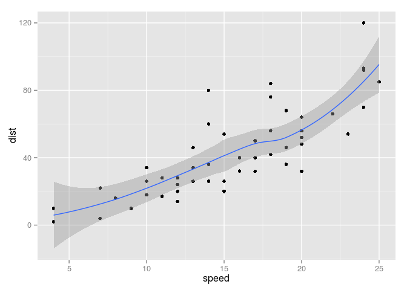

We can change the degree of smoothing (only for loess method).

``` r
ggplot(cars, aes(x = speed, y = dist)) +
  geom_point() +
  geom_smooth(span = 0.3) +
  geom_smooth(span = 10, colour = "red")
```

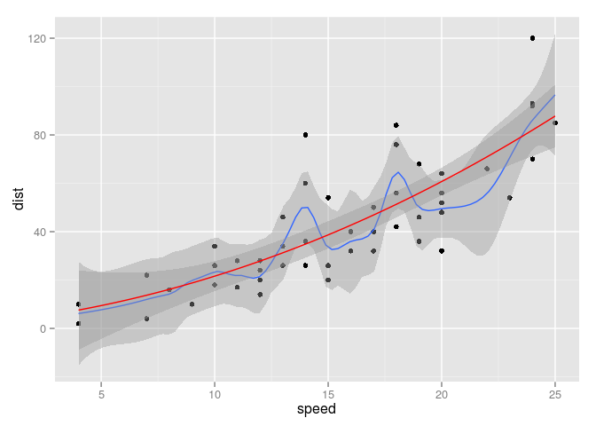

We can change the method of smoothin to "linear model".

``` r
ggplot(cars, aes(x = speed, y = dist)) +
  geom_point() +
  geom_smooth(method = "lm")
```

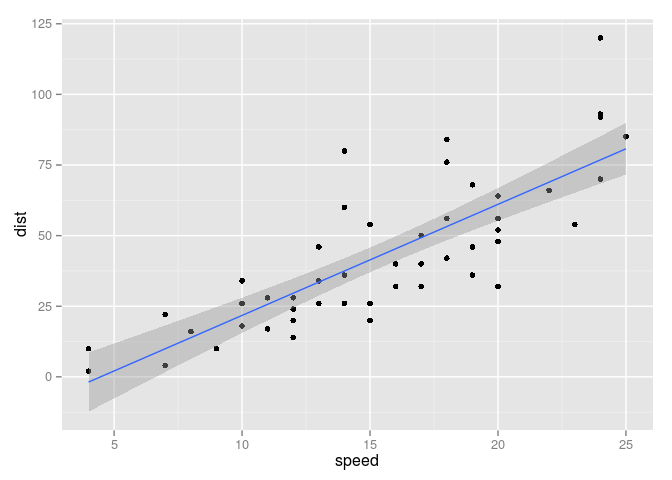

We can change the model formula.

``` r
ggplot(cars, aes(x = speed, y = dist)) +
  geom_point() +
  geom_smooth(method = "lm", formula = y ~ log(x))
```

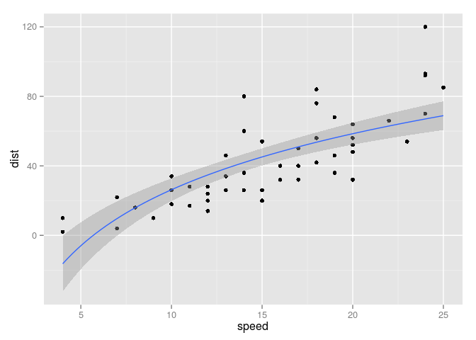

The smoothing also works groupwise if we specify groups. Note, that groupwise smoothing only works for discrete variables (e.g. factors).

``` r
ggplot(airquality, aes(x = Ozone, y = Wind, colour = as.factor(Month))) +
  geom_point() +
  geom_smooth(method = "lm", se = FALSE)
```

    ## Warning in loop_apply(n, do.ply): Removed 5 rows containing missing values
    ## (stat_smooth).

    ## Warning in loop_apply(n, do.ply): Removed 21 rows containing missing
    ## values (stat_smooth).

    ## Warning in loop_apply(n, do.ply): Removed 5 rows containing missing values
    ## (stat_smooth).

    ## Warning in loop_apply(n, do.ply): Removed 5 rows containing missing values
    ## (stat_smooth).

    ## Warning in loop_apply(n, do.ply): Removed 1 rows containing missing values
    ## (stat_smooth).

    ## Warning in loop_apply(n, do.ply): Removed 37 rows containing missing
    ## values (geom_point).

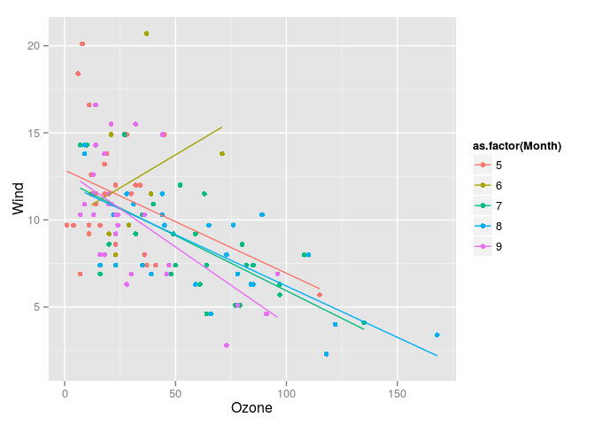

Summarising Data
----------------

Bin your data into categories (tabularise it) and plot the results as a dotplot. Note: `..count..` is an internal ggplot variable. It was produced by applying `stat_bin` (see `help("stat_bin")`) to our `diamonds` data and represents the number of cases with a specific `color` in our data. Different statistical transformations return different variables. Internal variables are always surrounded by two dots. We can map them to aesthetics like we would with variables in our data.

``` r
ggplot(diamonds, aes(x = color)) +
  geom_point(aes(y = ..count..), stat = "bin")
```

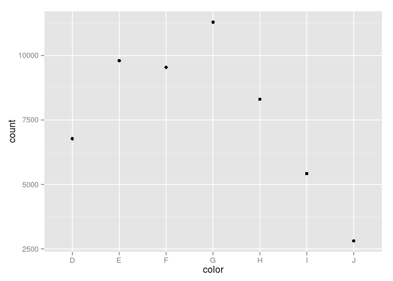

The `geom_bar` uses `stat_bin` as default as therefore produces roughly the same plot without further specifications.

``` r
ggplot(diamonds, aes(x = color)) +
  geom_bar()
```

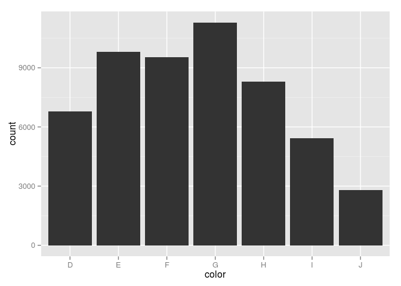

The binning also works for more than a single group.

``` r
ggplot(diamonds, aes(x = color)) +
  geom_point(aes(y = ..count.., shape = cut), stat = "bin") +
  geom_line(aes(y = ..count.., group = cut), stat = "bin")
```

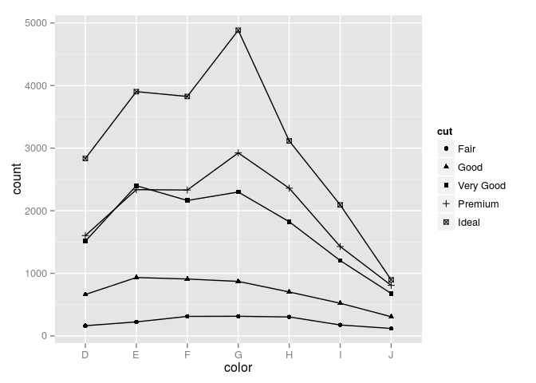

Also very useful is `stat_summary`. It allows us to take all unique x or y values and to summarise them in some way. E.g. take the mean of all y values at every unique x and plot it as a line. This can be a good alternative more elaborated smoothing methods.

``` r
ggplot(ChickWeight, aes(x = Time, y = weight)) +
  geom_point() +
  geom_line(stat = "summary", fun.y = "mean")
```

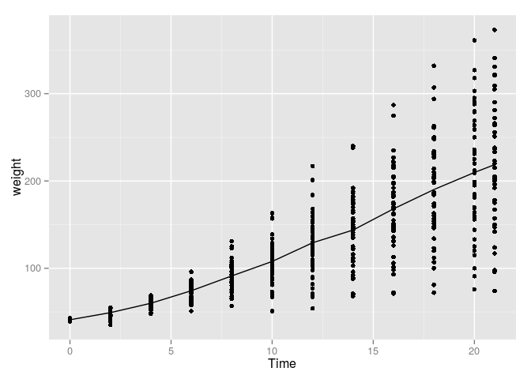

It also works groupwise.

``` r
ggplot(ChickWeight, aes(x = Time, y = weight, colour = Diet)) +
  geom_point() +
  geom_line(stat = "summary", fun.y = "mean")
```

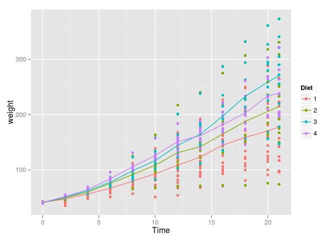

Densities of 2d data.

``` r
ggplot(quakes, aes(x = long, y = lat)) +
  geom_density2d() +
  geom_polygon(aes(fill = ..level..),
               alpha = 0.2,
               stat = "density2d")
```

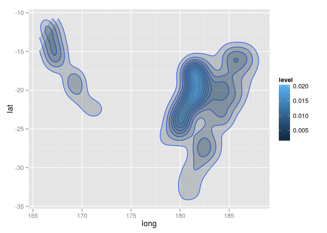

Summarising Marginal Distributions
----------------------------------

Plot marginal densities.

``` r
ggplot(cars, aes(x = dist)) +
  geom_density()
```

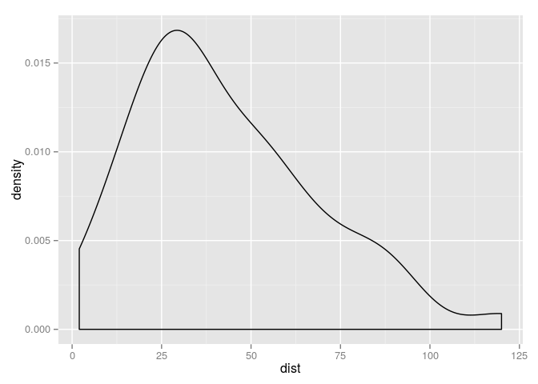

``` r
ggplot(cars, aes(x = speed)) +
  geom_density()
```

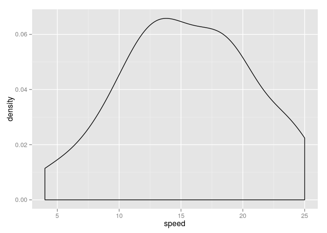

Add marginal distribution as "ticks" on axes.

``` r
ggplot(cars, aes(x = dist, y = speed)) +
  geom_point() +
  geom_rug()
```

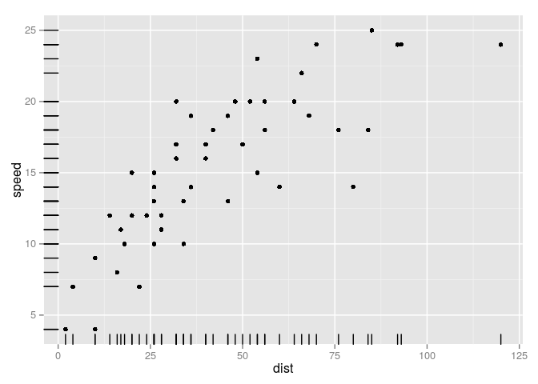

Add marginal means as vertical and horizontal lines.

``` r
ggplot(cars, aes(x = dist, y = speed)) +
  geom_point() +
  geom_hline(aes(yintercept = mean(speed))) +
  geom_vline(aes(xintercept = mean(dist)))
```

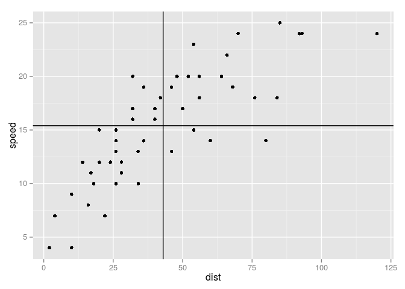

Add groupwise marginal means as vertical and horizontal lines.

``` r
ggplot(mtcars, aes(x = hp, y = qsec, colour = as.factor(am))) +
  geom_point() +
  geom_line(yintercept = mean, stat = "hline") +
  geom_line(xintercept = mean, stat = "vline")
```

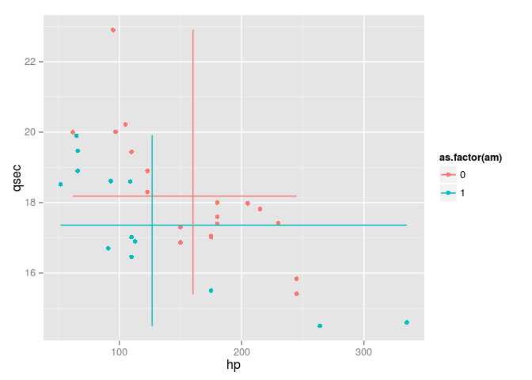
